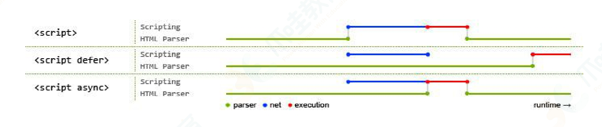

# HTML面试题

## HTML5新增了什么

HTML5是2014年10月完成标准制定。

HTML5总的来说比HTML4多了10个新特性

- 语义标签,header,nav,footer,aside,article,section, HTML5语义标签，可以使开发者更清晰构建页面的布局.
- 增强型表格
- video元素和audio元素 video支持`video/mp4`,`video/webm` audio支持`audio/mpeg`,`audio/wav`
- canvas元素 canvas元素可被用来通过JavaScript(Canvas API 或 WebGL API)绘制图形及图形动画。
- svg元素 SVG指可伸缩矢量图形。
- 地理定位API
- 拖放API
- WebWorker
- WebStorage包含2个具体实现,localStorage和sessionStorage
- WebSocket: WebSocket协议为web应用程序客户端和服务端之间提供了一种全双工通信机制.

## HTML5移除了什么?

- 纯表现的元素
- frame

## WebStorage是什么?

WebStorage是HTML新增的本地存储解决方案之一，但不是取代cookie的标准。cookie是HTTP协议的一部分。

WebStorage意在解决本来不应该cookie做，却不得不用cookie做的本地存储。

websorage拥有**5M**的存储容量，而cookie却只有**4K**

客户端存储数据有两个对象，其用法基本是一致。

localStorage：没有时间限制的数据存储

sessionStorage:在浏览器关闭的时候就会清除

## HTML form input原生如何关闭自动完成功能

设置autocomplete="off"

## \<!DOCTYPE html\>作用

\<!DOCTYPE html\>是HTML文档的声明,告诉浏览器HTML版本,\<!DOCTYPE html\>表示文档是基于HTML5的.如果不使用\<!DOCTYPE html\>,某些浏览器可能会用怪异模式渲染页面,导致不一致.

## img元素的alt,title区别

title是悬浮提示,alt是图片加载失败提示.

## 说下src和href的区别

```html
<script src="https://cdn.jsdelivr.net/toastui.min.js"></script>
<link href="https://cdn.jsdelivr.net/toastui-editor.css" rel="stylesheet">
```

src用于替换当前元素,href用于在当前文档和引用资源之间确立联系.

## 网络中图片格式

image/webp

## canvas元素的toBlob函数的type参数

canvas元素的toBlob函数的type参数用于指定生成的Blob对象的MIME类型.常见的有效值:

- image/png: 默认值
- image/webp: 推荐值

```js
canvasElement.toBlob(blob => {
  const file = new File([blob], 'cropper-image.webp', {
   type: 'image/webp',
  })
  console.log(file)
  this.$emit('exportImg', file)
}, 'image/webp', 0.95)
```

## HTML5事件模型

HTML标准事件模型,也就是事件流.包括3个阶段:

- **捕获阶段 (Capturing Phase)**：事件从文档的根节点document.documentElement开始，沿着 DOM 树向**事件目标元素**传递。在这个阶段，父级元素有机会优先处理事件。
- **目标阶段 (Target Phase)**：事件到达**事件目标元素**（即触发事件的元素）。
- **冒泡阶段 (Bubbling Phase)**：事件从**事件目标元素**开始，沿着 DOM 树向上传递，直到文档的根节点document.documentElement。父级元素可以在事件传递回去时处理它。

```js
element.addEventListener('click', function(event) {
  // 事件处理逻辑
  event.stopPropagation()
  event.preventDefault()
}, false)
```

- true: 表示事件在捕获阶段触发
- false: 默认,表示事件在冒泡阶段触发.

## 事件委托是什么?

事件委托基于 **事件冒泡** 的机制。

事件委托是HTML5事件模型的一个常见模式,通过将时间监听器绑定到父级元素,可以处理子元素触发的事件,避免为每个子元素绑定事件,优化性能.

- 减少内存消耗
- 处理动态元素

当我们想在用户与大量的子元素中的任何一个互动时运行一些代码时，我们在它们的父元素上设置事件监听器，让发生在它们身上的事件冒泡到它们的父元素上，而不必在每个子元素上单独设置事件监听器。

```html
<!DOCTYPE html>
<html lang="en">
<head>
	<meta charset="UTF-8">
	<title>学习事件冒泡</title>
	<style>
		* {
			margin: 0;
			padding: 0;
			box-sizing: border-box;
			flex-shrink: 0;
		}
	</style>
</head>
<body>
<div id="div" style="width: 600px;height: 600px;display: flex;flex-direction: column;">
	<div style="width: 100%;height: 100px;">1</div>
	<div style="width: 100%;height: 100px;">2</div>
	<div style="width: 100%;height: 100px;">3</div>
	<div style="width: 100%;height: 100px;">4</div>
	<div style="width: 100%;height: 100px;">5</div>
	<div style="width: 100%;height: 100px;">6</div>
</div>
<script type="module">
	const parentElement = document.getElementById('div')
	parentElement.addEventListener('click', event => {
    // event.target表示真实目标元素
		console.log('event.target: ', event.target)
    // event.currentTarget表示正在处理事件的元素,在这里为父元素
		console.log('event.currentTarget: ', event.currentTarget)
		event.target.style.backgroundColor = 'red'
	})
</script>
</body>
</html>
```

## HTML5默认编码

HTML默认编码可能不支持中文，因此需要指定编码格式，防止乱码。

```html
<!DOCTYPE html>
<html lang="en">
<head>
  <!--HTML默认不支持中文，指定UTF-8编码。但javascript默认编码为UTF16，无需指定编码-->
  <meta charset="UTF-8">
  <meta name="viewport" content="width=device-width, initial-scale=1.0" />
  <title>My first Vue app</title>
  <script src="https://unpkg.com/vue@2"></script>
</head>
```

[`charset`](https://developer.mozilla.org/zh-CN/docs/web/html/element/meta#charset)

该属性声明了文档的字符编码。如果存在该属性，则其值必须是字符串 `"utf-8"` 的不区分 ASCII 大小写的匹配，因为 UTF-8 是 HTML5 文档的唯一有效编码。声明字符编码的 `<meta>` 元素必须完全位于文档的前 1024 个字节内。

```html
<!--设置相对路径-->
<base href="/basic/" >
```

## 常见BOM对象

- window,
- location
- history
- navigator
- 

## HTML引入外部CSS的方式

在HTML文件中，可以使用**\<link\>**标签来引入CSS文件

```html
<!doctype html>
<html lang="en">
  <head>
    <meta charset="UTF-8" />
    <link rel="icon" type="image/svg+xml" href="/vite.svg" />
    <meta name="viewport" content="width=device-width, initial-scale=1.0" />
    <title>Vite App</title>
    <link rel="stylesheet" type="text/css" href="style.css">
  </head>
  <body>
    <div id="app"></div>
    <script type="module" src="/main.js"></script>
  </body>
</html>
```

`<link>` 标签的 `rel`、`type` 和 `href` 属性在HTML中的含义如下：

1. `rel`：这个属性定义了当前文档与被链接文档之间的关系。例如，当 `rel` 的值为 "stylesheet" 时，表示被链接的文档是一个样式表。

2. `type`：这个属性定义了被链接文档的MIME类型。对于CSS样式表，`type` 的值通常为 "text/css"。

3. `href`：这个属性指定了被链接文档的URL。这可以是相对路径或绝对路径。

例如，如果你想在HTML文档中链接一个CSS样式表，你可以这样写：

```html
<link rel="stylesheet" type="text/css" href="styles/style.css">
```

在这个例子中，`rel="stylesheet"` 表示被链接的文档是一个样式表，`type="text/css"` 表示文档的类型是CSS，`href="styles/style.css"` 指定了样式表的位置。


```html
<link rel="icon" type="image/svg+xml" href="/vite.svg" />
```

引入icon

## HTML引入外部js的方式

```html
<!doctype html>
<html lang="en">
  <head>
    <meta charset="UTF-8" />
    <link rel="icon" type="image/svg+xml" href="/vite.svg" />
    <meta name="viewport" content="width=device-width, initial-scale=1.0" />
    <title>Vite App</title>
  </head>
  <body>
    <div id="app"></div>
    <script type="module" src="/main.js"></script>
  </body>
</html>
```

## script标签的type值

1. text/javascript：这是默认值，表示脚本是JavaScript,可以省略。  
2. module：表示脚本应作为JavaScript模块执行。这意味着脚本中可以使用 import 和 export 语句。  

\<script type="module" src="/main.js"\>\<script\>中的type="module"表示这个script标签加载的JavaScript文件应被当做ES6模块。ES6模块是一种可以导入和导出功能的JavaScript文件。

在 ES6 模块中，你可以使用 import 和 export 语句来导入和导出函数、对象或值。这种方式可以帮助你组织代码，使得代码更易于管理和调试。


如果你不在\<script\> 标签中使用 type="module"，那么浏览器将会把这个 \<script\> 标签加载的 JavaScript 文件当作一个普通的脚本，而不是一个 ES6 模块。这意味着你不能在这个文件中使用 import 和 export 语句来导入和导出函数、对象或值。

在HTML文件中使用外部js的方法，外部js方法必须为全局作用域。

tpye='module'的为模块作用域，在HTML中不可以直接访问。

## script标签的crossorigin属性

crossorigin是一个HTML属性，它定义了一个元素如何处理跨源请求

- 如果没有设置crossorigin属性，或者属性值为空字符串，那么元素将不会发出CORS请求，而是发出一个普通的同源请求
- anonymous：这将设置请求的credentials模式为'same-origin'，这意味着跨源请求将在没有凭证的情况下进行，但如果响应包含正确的CORS头部，则可以读取响应
- use-credentials：这将设置请求的credentials模式为'include'，这意味着跨源请求将带有凭证，如果响应没有包含正确的CORS头部，浏览器将拒绝读取响应

## script标签的async和defer

**async**和**defer**都是HTML的script标签的属性，它们都可以改变浏览器加载和执行脚本的方式，但是它们的行为和应用场景不同。

**async**属性适用于不依赖其它脚本，也不修改DOM的脚本。

**defer**属性适用于那些需要在DOM解析完成后才能执行，或者依赖于其它脚本的脚本。



### async

下载完成，立即执行，可能不按照顺序，可能阻塞HTML解析。

对于普通脚本，如果存在async属性，那么普通脚本会被并行请求，并尽快解析和执行，可能会阻塞HTML的渲染。

对于模块脚本，如果存在async属性，那么脚本及其所有依赖都会在延缓队列中执行，因此它们会被并行请求，并尽快解析和执行。

该属性能够消除**解析阻塞的JavaScript**，解析阻塞的JavaScript会导致浏览器必须加载并且执行脚本，之后才能继续解析。defer在这一点上有类似的作用。

这个是布尔属性：布尔属性的存在意味着true值，布尔属性的缺失意味着false值。

### defer

defer是HTML的script标签的一个属性，这个布尔属性的设置是为了向浏览器表明，该脚本是要在文档解析完成后执行脚本。这意味着如果你的脚本包含了对DOM的操作，使用**defer**可以确保这些操作在DOM已经完成加载后执行，避免了因DOM尚未加载完成而导致的错误。

当script标签的type属性设置为module时，defer属性会默认开启，这是因为模块脚本总是要等到整个文档解析完毕后才开始执行

defer只对外部脚本有效，即通过src属性引入的脚本，对于内联脚本无效。

defer定义的脚本会等待css加载完毕。

包含 `defer` 属性的脚本会按照它们出现在文档中的顺序执行。


