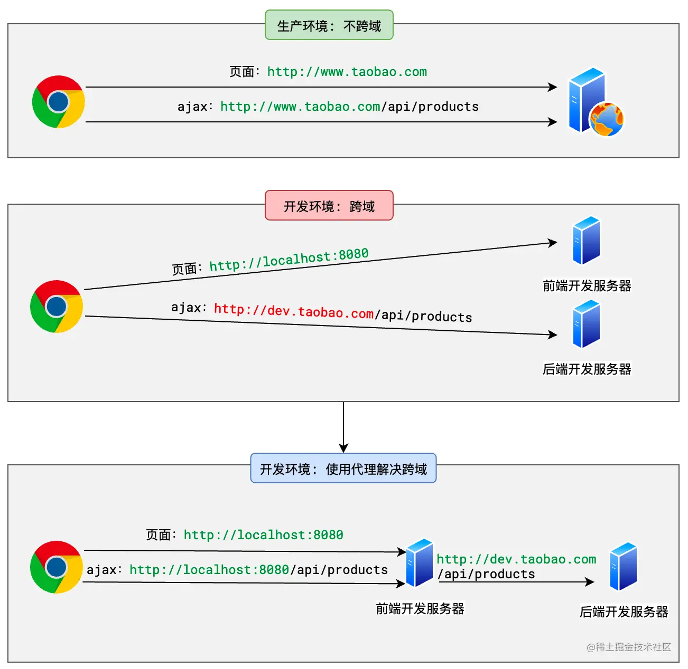
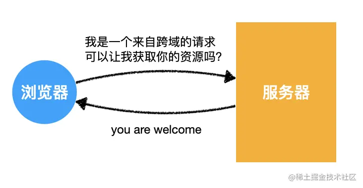
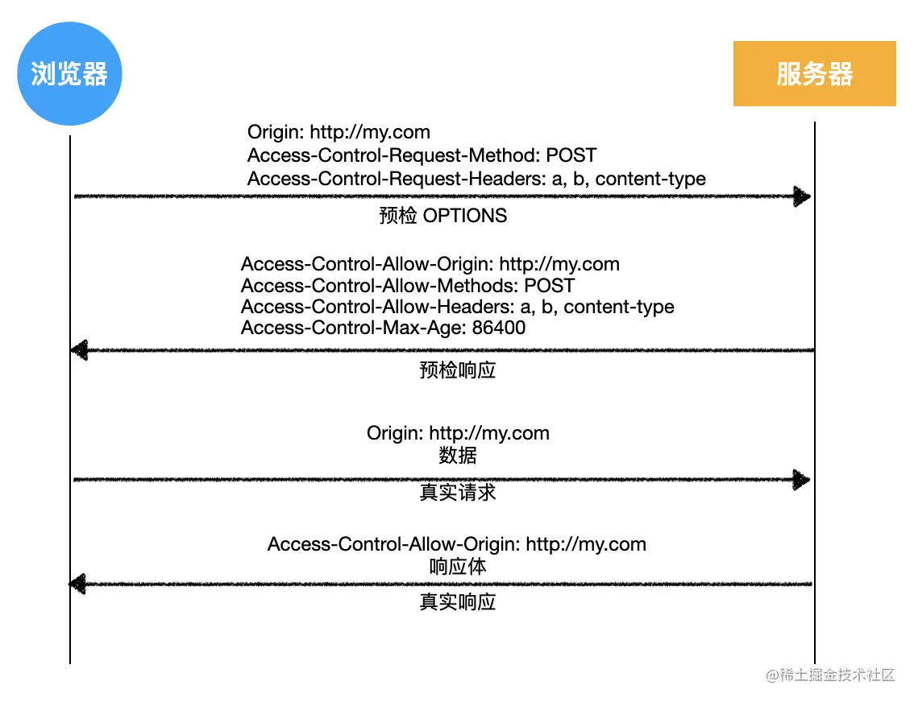
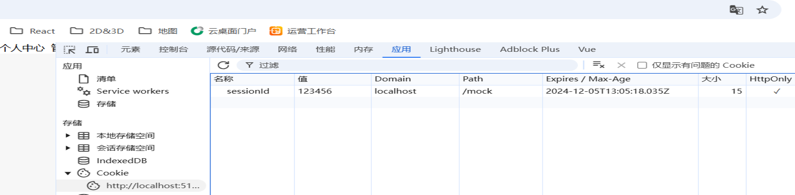

# HTTP面试题

# 应用层

## HTTP

### GET和POST的区别

- GET参数使用url传递有长度限制.POST放在body中,无长度限制.
- GET因为没有body,所以也没有Content-type属性.
- GET更不安全
- GET只接受ASCLL字符,post无限制
- GET产生一个TCP数据包,POST产生2个TCP数据包.

### 什么是状态码

HTTP状态码是服务器响应客户端请求时返回的3位数字代码.

- 2xx:成功
- 3xx:重定向
- 4xx:客户端错误
  - 401:需要认证
  - 403:请求被拒绝
  - 404:请求资源未找到
- 5xx:服务器错误

### 什么是Cookie

一种保存信息的方式,在发送请求时自动带着.

每种存储方式的大小限制可能会因浏览器的不同而有所不同，但通常，它们的大小限制大致如下：

- `localStorage`：最大存储容量约为5MB。
- `sessionStorage`：最大存储容量约为5MB。
- `cookie`：每个cookie的大小限制为4KB，而且每个域名下的cookie总数也有限制，通常为20个。

在同源的情况下,父网站和嵌套的同源iframe子网站的Cookie可以共享,取决于cookie属性对应的**Path**属性:

- 如果Cookie设置为Path=/, 则所有路径下的页面都能访问该Cookie
- 如果Cookie设置Path=/a,则只有/a下的页面能访问该Cookie,/b下无法访问.
- 如果没有明确设置Path,默认是当前设置Cookie的路径及其子路径,例如,在/a页面下设置的Cookie默认只对/a及其子路径生效.

SameSite属性:

- SameSite=Strict: Cookie 只会在同一站点的同一路径下发送，嵌套的 iframe 访问可能受限。
- **`SameSite=Lax`**：允许 Cookie 在同源的顶级导航请求中发送，但跨路径可能依然有限制。
- **`SameSite=None`** 且 **`Secure`**：允许跨站点请求时发送 Cookie（需要 HTTPS）。

### 什么是Session

Session是一种在服务器端维持用户状态的解决方案.通过Cookie传递.

在前后端分类的网站中,可以使用token,保存在localStorage或sessionStorage中,无需使用cookie,设置到HTTP head中即可.

### 接口请求方法?

有get,post等

### HTTP发展史

- HTTP/0.9 单行协议，1991 年
- HTTP/1.0 构建可拓展性，1996年
- **HTTP/1.1 标准化的协议，默认协议，1997年**
- HTTP/2 为了提高性能，2015年
- HTTP/3 基于QUIC的HTTP，为了更低的延迟，2022年

### HTTP2.0和HTTP1.1的区别

格式不同:HTTP1.1头信息是文本,body可能是文本或二进制,HTTP2.0是彻底的二进制格式.

多路复用:HTTP2.0实现了多路复用,可以避免队头阻塞问题

头部压缩:

服务器推送:

## HTTPS

### 和HTTP区别

HTTPS是HTTP的安全版本.它在HTTP的基础上增加了安全层,主要通过TLS(之前称为SSL)协议来加密通信,确保内容安全和完整.

HTTPS需要证书

HTTP默认80,HTTPS默认443

HTTPS可以有效防止运营商劫持.

### TLS协商过程

#### 1. 客户端发送请求

客户端向服务器发送TLS协商请求,该请求会包含客户端支持的SSL/TLS版本,加密算法等信息.

#### 2. 服务器发送证书

服务器收到请求后,选择SSL/TLS版本和加密算法,并返回服务器的数字证书.

#### 3. 客户端验证证书和发送一个随机数作为会话秘钥

客户端会验证证书是否有效,如果无效,则会提示用户.如果有效,会生成一个随机数,使用服务器的公钥进行加密,并发送给服务器.

#### 4. 服务器获取会话秘钥和回复收到

服务器使用自己的私钥解密这个随机数,从而获得会话秘钥.至此,客户端和服务器都有相同的会话秘钥,接下来双方将使用该会话秘钥进行对称加密通信.对称加密通信速度快,适合大量数据传输.

#### 5. 客户端回复收到

客户端回复收到.

### HTTPS握手过程中，客户端如何验证证书的合法性？

1. 浏览器接收服务器发送的证书链
2. 验证证书链的每一层：
   1. 检查有效期
   2. 使用上级证书的公钥验证下级证书的签名，确保证书未被篡改
   3. 验证根证书是否在浏览器的受信任根证书列表中
3. 检查证书是否吊销
4. 检查证书中的域名和实际域名是否匹配

# 传输层

## TCP

### 滑动窗口是什么?过大过小影响?

TCP的滑动窗口机制是一种重要的流量控制技术,通过动态调整数据传输窗口大小.

### 可靠传输如何实现

TCP的可靠传输原理通过数据分段,确认应答,重传机制,流量控制,拥塞控制等实现.

### 拥塞控制

**拥塞窗口（CWND）**：TCP 使用拥塞窗口机制控制网络中的数据流量，避免网络过载。拥塞窗口的大小根据网络的拥塞情况动态调整。

**算法**：TCP 采用多种算法来实现拥塞控制，如慢启动、拥塞避免、快速重传和快速恢复等。慢启动阶段会快速增加拥塞窗口的大小，而在拥塞发生时会减少窗口大小。

### 快速重传

收方收到的数据段中可能有一些丢失，接收方会重复发送收到的段的确认（重复 ACK），通知发送方重新发送丢失的数据段。

### 三次握手

1. 第一次握手:客户端向浏览器发送一个序列号
2. 第二次握手:服务器发送对客户端序列号的确认,也就是下一个接收的序列号.同时发送自己的一个序列号
3. 第三次握手:客户端发送对服务器序列号的确认.

## HTTP三次握手,2次不行吗?

不行,第3次握手是客户端对服务器端的初始序号的确认.如果只使用2次握手,那么服务器就没有办法知道自己的序号是否已被确认.同样也是为了防止失效的请求报文被服务器接收,服务器开启无效连接浪费资源.

### 四次挥手

1. 第一次挥手:客户端向服务器发送释放请求
2. 第二次挥手:服务器收到客户端发来的释放请求,发送收到,此时服务器不在收取客户端发送的数据,但是可以向客户端发送数据
3. 第三次挥手:服务器向客户端发送释放请求
4. 第四次挥手:客户端收到服务器发来的释放请求,不再接收服务器发送的数据,同时向服务器发送收到.此时需要等待2个报文段在网络中生存的时间,防止发送给服务器的报文出错,导致服务器无法理解而不能正常关闭.

## UDP

不可靠传输.

# 如何开启HTTPS

- 创建证书
- 将证书添加到系统受信任根目录中
- vite配置证书
- nginx配置证书和属性，强制HTTPS

## 创建证书

打开git bash，

```bash
# 生成SSL私钥
openssl genpkey -algorithm RSA -out localhost.key
# 生成自签名SSL证书请求，Common name设置为localhost
openssl req -new -key localhost.key -out localhost.csr
# 生成自签名SSL证书，此命令将使用私钥 localhost.key 签署证书请求 localhost.csr，并生成有效期为 365 天的自签名# 证书 localhost.crt。
openssl x509 -req -days 365 -in localhost.csr -signkey localhost.key -out localhost.crt
```


```bash
# 生成SSL私钥
openssl genpkey -algorithm RSA -out local.key
# 生成自签名SSL证书请求，Common name设置为local
openssl req -new -key local.key -out local.csr
# 生成自签名SSL证书，此命令将使用私钥 local.key 签署证书请求 local.csr，并生成有效期为 365 天的自签名# 证书 local.crt。
openssl x509 -req -days 365 -in local.csr -signkey local.key -out local.crt
```


## 将证书添加到系统受信任根目录中

**打开 Windows 证书管理工具**：

- 按 `Win + R`，输入 `certmgr.msc` 并按 Enter。

**导入证书**：

- 展开 `“受信任的根证书颁发机构”`，右键点击 `“证书”`，选择 `“所有任务”` -> `“导入”`。
- 在导入向导中选择生成的 `localhost.crt` 文件，确保将其放入 `“受信任的根证书颁发机构”` 存储。

##vite配置证书

将localhost.key 和localhost.crt复制到项目根目录，然后配置vite.config.js

```js
// 导出vite配置
export default defineConfig({
  localhost: {
    // 配置HTTPS
    https: {
      key: './localhost.key',
      cert: './localhost.crt',
    },
  },
})
```

## Nginx服务器配置

使用同样上述方式生成**jiangjiang0123.cn.key**和**jiangjiang0123.cn.crt**文件，复制到服务器的Nginx配置目录的`/etc/nginx/ssl/` 目录中，然后在Nginx配置文件中引入即可。

- 设置头信息强制使用HTTPS
- 访问80的话，return https://xxx
- server 443的部分，引入证书

配置详见nginx部分。

# 如何处理跨源请求

## 什么是跨域

浏览器有一个重要的安全策略，称之为**同源策略**，源 = origin，即协议protocol + hostname + port，两个源origin相同，称之为同源；否则称为跨源或跨域。

| 源origin 1            | 源origin 2                | 是否同源origin |
| --------------------- | ------------------------- | -------------- |
| http://www.baidu.com  | http://www.baidu.com/news | √              |
| https://www.baidu.com | http://www.baidu.com      | ×              |
| http://localhost:5000 | http://localhost:7000     | ×              |
| http://localhost:5000 | http://127.0.0.1:5000     | ×              |
| http://www.baidu.com  | http://baidu.com          | ×              |

**同源策略**是指，如果**页面的源**和**请求的源**不是同源时，出于安全考虑，浏览器会对请求进行限制

- 默认不允许ajax访问跨域资源
- 通过iframe嵌套网站时,不同源网站,不可以直接访问,需要通过postMessage通信.

我们通常所说的跨域问题，就是同源策略对ajax请求产生的影响。

## 如何解决

常见的解决方案：

- 代理
- CORS

### 代理

代理是解决跨域的常用方法

- **开发环境(正向代理)**：我们不直接访问后端服务器，而是访问前端开发服务器，前端开发服务器和前端项目是同源，不会有任何限制；前端开发服务器访问配置的后端服务器，将结果返回给前端代码
- **生产环境(反向代理)**：我们的前端项目一般部署在Nginx服务器，接口请求时请求的也是Nginx服务器，Nginx服务器转发给后端服务器，一般为同一个机器的不同端口，然后将结果返回。对用户的浏览器来说，依然没有产生跨域。

使用代理方式，后端无需做任何配置，前端直接搞定。一般使用**/api**前缀来标识这是一个针对后端网络请求，

- 对于开发环境，我们设置vite配置即可

  ```js
  // 导出vite配置
  export default defineConfig({
    // ...其它配置
    // 开发服务器配置
    server: {
      // ...其它配置
      
      // 配置代理，在代码不直接访问后端服务器，而是访问开发服务器，因此没有跨域问题；
      // 开发服务器负责转发请求，并将结果返回给前端程序。
      proxy: {
        '/api': {
          target: 'http://localhost:8080',
          changeOrigin: true,
          // /api/user -> /user
          rewrite: path => path.replace(/^\/api/, ''),
        },
      },
    },
  })
  ```

- 对于生产环境，我们设置Nginx服务器即可。

  ```nginx
  http {
    server {
      location /api {
        rewrite ^/api(.*)$ $1 break; # 去除 /api 前缀
        proxy_pass http://localhost:8080;
      }
    }
  }
  ```

  



### CORS

CORS的全称是Cross-Origin Resource Sharing，跨域资源共享。

它的总体思路是：如果浏览器要跨域访问服务器的资源，需要获得服务器的许可。



CORS规定了3种不同的交互模式：

- 简单请求
- 需要预检的请求
- 附带身份凭证的请求

#### 简单请求

当请求同时满足以下条件时，浏览器会认为它是一个简单请求：

- 请求方法为get，post，head
- 请求头仅包含安全的字段
- 请求头如果包含Content-Type,只能是3个值，**text/plain**，**application/x-www-form-urlencoded**，**multipart/form-data**

服务器如果允许请求的话，需要设置一些头部信息：

```js
// 设置响应头，允许跨域访问
res.setHeader('Access-Control-Allow-Origin', '*');
res.setHeader('Access-Control-Allow-Methods', 'GET, POST, PUT, DELETE, OPTIONS');
res.setHeader('Access-Control-Allow-Headers', 'Content-Type, Authorization');
```

如果响应没有设置这些信息，浏览器会报CORS错误。

#### 需要预检的请求

对于非简单请求，浏览器会先发送预检信息，询问服务器是否允许请求

- 预检请求的方法为**OPTIONS**
- 没有请求体

预检返回成功信息，浏览器会发送实际请求。



# Conent-Type

Content-Type 是 HTTP 请求头中的一个字段，用于指示请求或响应中包含的实体主体的媒体类型。它告诉服务器或客户端如何解析请求或响应的主体数据。

```
Content-Type: text/html; charset=utf-8
Content-Type: multipart/form-data; boundary=something
```

Content-Type包含3个属性:

- media-type: 资源或数据的MIME类型
- charset: 字符编码标准
- boundary: 对于多部分实体，必须使用 `boundary` 指令。

GET请求无需Content-Type属性。

# 什么是MIME嗅探

MIME(Multipurpose Internet Mail Extensions，多用途互联网邮件扩展类型)

MIME嗅探是浏览器猜测服务器发生的资源的正确MIME类型

通常情况下，服务器会发送资源时附带正确的 MIME 类型。但是，有时服务器可能不正确地配置 MIME 类型或者资源没有明确的 MIME 类型。这时，浏览器就会进行 MIME 嗅探，尝试通过分析资源的内容来猜测其正确的 MIME 类型。

在缺失 MIME 类型或客户端认为文件设置了错误的 MIME 类型时，浏览器可能会通过查看资源来进行 *MIME 嗅探*。

每一个浏览器在不同的情况下会执行不同的操作。（例如，Safari 会在发送的 MIME 类型不合适时查看文件的扩展名。）由于某些 MIME 类型可能代表可执行内容，会存在一些安全问题。服务器可以通过发送 [`X-Content-Type-Options`](https://developer.mozilla.org/zh-CN/docs/Web/HTTP/Headers/X-Content-Type-Options) 标头来阻止 MIME 嗅探。

# MIME类型(IANA媒体类型)

MIME类型是一种标准，用来表示内容的格式。浏览器通常使用MIME类型而不是文件拓展名来决定如何处理URL，因此设置正确的Content-Type标头非常重要。

## MIME结构

MIME 类型通常仅包含两个部分：*类型*（type）和*子类型*（subtype），中间由斜杠 `/` 分割，中间没有空白字符：type/subtype

- **类型**代表数据类型所属的大致分类，如video，text
- **子类型**表示确切数据类型

每种类型都有自己的一组可能的子类型。一个 MIME 类型总是包含类型与子类型这两部分，且二者必需成对出现。

例如，对于主类型为 `text` 的任何 MIME 类型，可以添加可选的 `charset` 参数，以指定数据中的字符所使用的字符集。如果没有指定 `charset`，默认值为 [ASCII](https://developer.mozilla.org/zh-CN/docs/Glossary/ASCII)（`US-ASCII`），除非被[用户代理的](https://developer.mozilla.org/zh-CN/docs/Glossary/User_agent)设置覆盖。要指定 UTF-8 文本文件，则使用 MIME 类型 `text/plain;charset=UTF-8`。

MIME 类型对大小写不敏感，但是传统写法都是小写。参数值可以是大小写敏感的。

## MIME类型

类型可分为两类：**独立的**（discrete）和**多部分的**（multipart）。独立类型代表单一文件或媒介，比如一段文字、一个音乐文件、一个视频文件等。而多部份类型，可以代表由多个部件组合成的文档，其中每个部分都可能有各自的 MIME 类型；

### 独立类型

#### application

2种情况：未知类型的二进制数据，或者代表以某种方式执行或解释的数据。

- **application/octet-stream**: 二进制数据，表示未知类型的文件
- **application/json**: **JSON**格式的文本数据
- **application/x-www-form-urlencoded**：这种编码格式通常用于提交 HTML 表单中的数据，或者body参数为URLSearchParams对象的POST请求
- **application/javascript** 推荐使用这个表示JavaScript文件
- **application/vnd.apple.mpegurl** m3u8文件

#### audio

音频数据。

#### video

视频数据

- **video/mp4**
- **video/mp2t** ts格式文件

#### font

字体数据

- **font/woff**
- **font/ttf**

#### image

图像数据

- **image/png**
- **image/jpeg**
- **image/webp**
- **image/svg+xml** **svg**格式图片文件

#### text

纯文本数据

- **text/plain**：表示请求或响应的主体是没有明确子类型的纯文本数据。
- **text/csv**
- **text/html** 所有的 HTML 内容都应该使用这种类型。
- **text/css** 在网页中要被解析为 CSS 的任何 CSS 文件**必须**指定 MIME 为 `text/css`。
- **text/javascript** 表示JavaScript文件，但是推荐使用application/javascript表示。

### 多部分类型

多部分类型指的是可分成不同部分的数据，各部分可以是不同的MIME类型。

**multipart**表示多部分类型，

- **multipart/form-data**：使用**FormData** API生成的数据，表示请求的主体包含多部分数据，通常用于文件上传。

# 常见的HTTP请求头

# 常见的HTTP响应头

## set-cookie

set-cookie: sessionId=123456; HttpOnly; Secure; Max-Age=86400

浏览器会根据该set-cookie属性来设置cookie.



## Access-Control-Allow-Origin

Access-Control-Allow-Origin: *

允许跨域.


