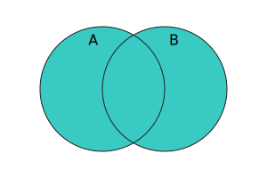
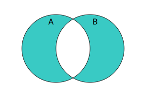

# Set

Set对象允许你存储任何类型的唯一值。

Set对象基于**零值相等**算法比较，Set对象是值的集合。

```javascript
// 语法
// new Set()
// new Set(iterator)

const set1 = new Set([1, 2, 3, 4, 5]);

console.log(set1.has(1));
// Expected output: true

console.log(set1.has(5));
// Expected output: true

console.log(set1.has(6));
// Expected output: false

```

Set()必须使用new创建。

# Set属性(1个)

## size

返回数量

# Set方法(16个)

## 遍历方法(5个)

### Set.prototype.keys()

和values()方法一致。

### Set.prototype.values()

返回值的迭代器对象。

### Set.prototype.entries()

返回元素迭代器对象，格式为\[value, value\],为了保持和Map的API一致。

### Set.prototype\[Symbol.iterator\]\(\)

和Set.prototype.values()一致。

### Set.prototype.forEach()

为每个值执行一个提供的函数。

## 修改方法(3个)

### Set.prototype.add()

添加一个元素，返回set对象，因此可以链式调用。

```javascript
// 语法
// add(value)
```

### Set.prototype.delete()

删除指定元素，成功返回true，失败返回false

### Set.prototype.clear()

清空set对象

## 查找和判断方法(4个)

### Set.prototype.has()

判断是否存在指定的元素

### Set.prototype.isSubsetOf()

判断set1是不是set2的子集。

A ⊆ B === (∀x ∈ A , x ∈ B)


### Set.prototype.isSupersetOf()

判断set1是否包含set2

A ⊇ B === (∀x ∈ B , x ∈ A)


### Set.prototype.isDisjointFrom()

判断2个set是否不相交，如果不相交返回true，否则返回false。

A disjoint B === (A ∩ B = ∅)


## 实用方法(4个)

### Set.prototype.union()

返回并集
A ∪ B = {x | x ∈ A | x ∈ B}



### Set.prototype.intersection()

返回交集

```javascript
// 语法
// intersecction(other)
```

A ∩ B = {x ∈ A | x ∈ B}


### Set.prototype.difference()

difference()方法返回set中有，但set2中没有的元素的新set。

A \ B = {x ∈ A | x ∉ B}


- 不改变原set
- 返回新set

```javascript
// 语法
// defference(other)

const set1 = new Set([1,2,3,4,5]);
const set2 = new Set([2,4,6,8,10]);
const set3 = set1.difference(set2)
console.log(set3)// Set(3) {1,3,5}
```


### Set.prototype.symmetricDifference()

返回A和B的并集 - A和B的交集

A ⊖ B === ((A \ B) ∪ (B \ A))




