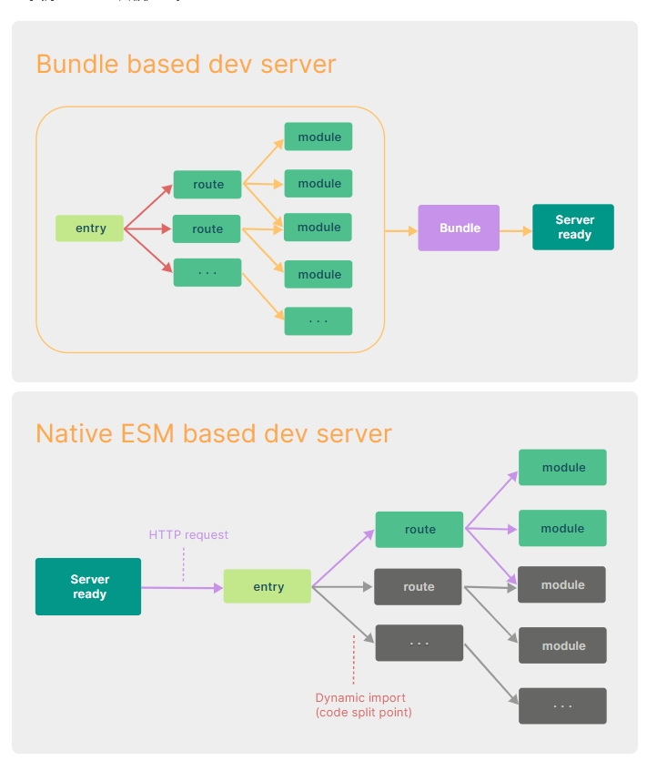

# [Vite](https://cn.vitejs.dev/)

## 版本

vite最新版本为**v5.4.2**

## Vite是什么

vite是下一代的前端工具链，为开发提供极速响应

- 极速的服务启动，使用原生ESM文件，无需打包
- 轻量快速的热重载，无论应用程序大小如何，都始终极快的模块热更换(HMR)
- 丰富的功能，对TypeScript，JSX，CSS等支持开箱即用
- 优化的构建，可配置Rollup构建
- 通用的插件
- 完全类型化的API，灵活的API和完整的TypeScript类型。

# 为什么选Vite

## 现实问题

在浏览器支持ES模块之前，JavaScript没有提供原生机制让开发者以模块化的方式进行开发。这也是我们对"打包"这个概念熟悉的原因：使用工具抓取，处理并将我们的源码模块串联成可以在浏览器中运行的文件。

常见的打包工具：

- Webpack
- rollup

然而，当我们开始构建大型应用时，需要处理的JavaScript代码呈指数级增长。包含数千个模块的大型项目很普遍。基于JavaScript开发的工具就会开始遇到性能瓶颈：

- 很长时间才能启动开发服务器
- 即使使用热替换(HMR)，文件修改的效果也需要几秒钟才能在浏览器中反应出来

Vite旨在利用生态系统中的新进展解决上述问题：

浏览器开始原生支持ES模块，且越来越多JavaScript工具使用编译型语言编写

## 缓慢的服务器启动

Vite 通过在一开始将应用中的模块区分为 **依赖** 和 **源码** 两类，改进了开发服务器启动时间。

### 依赖

Vite使用esbuild预构建依赖，esbuild使用Go编写，比以JavaScript编写的打包器预构建依赖快10-100倍。

### 源码

通常包含一些并非直接是 JavaScript 的文件，需要转换（例如 JSX，CSS 或者 Vue/Svelte 组件），时常会被编辑。同时，并不是所有的源码都需要同时被加载（例如基于路由拆分的代码模块）。

Vite 以 [原生 ESM](https://developer.mozilla.org/en-US/docs/Web/JavaScript/Guide/Modules) 方式提供源码。这实际上是让浏览器接管了打包程序的部分工作：Vite 只需要在浏览器请求源码时进行转换并按需提供源码。根据情景动态导入代码，即只在当前屏幕上实际使用时才会被处理。



## 缓慢的更新

传统方式需要整个重新构建并重载页面。即使采用了 HMR 模式，其热更新速度也会随着应用规模的增长而显著下降。

在 Vite 中，HMR 是在原生 ESM 上执行的。当编辑一个文件时，Vite 只需要精确地使已编辑的模块与其最近的 HMR 边界之间的链失活[[1\]](https://cn.vitejs.dev/guide/why.html#footnote-1)（大多数时候只是模块本身），使得无论应用大小如何，HMR 始终能保持快速更新。

Vite 同时利用 HTTP 头来加速整个页面的重新加载（再次让浏览器为我们做更多事情）：源码模块的请求会根据 `304 Not Modified` 进行协商缓存，而依赖模块请求则会通过 `Cache-Control: max-age=31536000,immutable` 进行强缓存，因此一旦被缓存它们将不需要再次请求。

## 为什么生产环境仍需打包

尽管原生ESM得到了广泛支持，但由于嵌套导入会导致额外的网络往返，在生产环境中发布未打包的ESM仍然效率低下(即使使用HTTP/2)。为了在生产环境中获得最佳的加载性能，最好还是将代码进行tree-shaking，懒加载和chunk分割(获得更好的缓存)。

## 为何不用ESbuild打包

Vite目前的插件API与使用esbuild作为打包器并不兼容。

# 开始

## 总览

Vite是一种新型的前端构建工具，能够显著提高前端开发体验。它主要由两部分构成：

### 一个开发服务器

它基于原生ES模块，提供了丰富的功能，比如速度很快的模块热更新(HMR)。

### 一套构建指令

它使用**Rollup**打包你的代码，并且它是预配置的，可输出用于生产环境的高度优化过的静态资源。

Vite是一种具有明确建议的工具，具备合理的默认配置。

- 在功能指南中了解Vite的各种可能性
- 通过插件，Vite支持与其它框架或工具的集成
- 如有需要，可以通过配置部分自定义适应你的项目
- Vite还提供了强大的拓展性，可通过插件API或JavaScript API进行拓展，并提供完整的类型支持

## 浏览器支持

### 开发环境

在开发阶段，Vite将**esnext**作为转化目标，**esnext**永远指向下一个版本，因为我们假设使用的是现代浏览器，它支持所有最新的JavaScript和CSS特性，这样可以防止语法降级，让Vite尽可能地接近原始源代码。

### 生产环境

对于生成环境，默认情况下Vite的目标浏览器是支持原生ES模块，原生ESM动态导入和import.meta。旧版浏览器可以通过官方的@vitejs/plugin-legacy。

## 搭建第一个Vite项目

兼容性注意：

Vite需要Node.js版本为18+， 20+。然而，有些模块需要依赖更高的Node版本才能正常运行，当你的包管理器发出警告时，请注意升级你的Node版本。

```cmd
# npm方式
npm create vite@latest my-app
# 等效于下面2条命令
npm install -g create-vite@latest
create-vite my-app
```

**create-vite**目前的最新版本为**5.5.2**

然后按照提示操作即可！

你还可以通过附加的命令行直接指定项目名称和你想要使用的模板。

查看create-vite以获取每个模板的更多细节：

- `vanilla`
- `vanilla-ts`
- `vue`
- `vue-ts`
- `react`
- `react-ts`
- `react-swc`
- `react-swc-ts`

### 社区模板

create-vite是一个快速生成主流框架基础模板的工具。

## index.html和项目根目录

你可能已经注意到，在一个 Vite 项目中，`index.html` 在项目最外层而不是在 `public` 文件夹内。这是有意而为之的：在开发期间 Vite 是一个服务器，而 `index.html` 是该 Vite 项目的入口文件。

vite.config.js是vite的配置文件，位于vite的根目录

### 命令行界面

在安装了 Vite 的项目中，可以在 npm scripts 中使用 `vite` 可执行文件，或者直接使用 `npx vite` 运行它。下面是通过脚手架创建的 Vite 项目中默认的 npm scripts：

```json
{
  "scripts": {
    "dev": "vite", // 启动开发服务器，别名：`vite dev`，`vite serve`
    "build": "vite build", // 为生产环境构建产物
    "preview": "vite preview" // 本地预览生产构建产物
  }
}
```

可以指定额外的命令行选项，如 `--port` 或 `--open`。运行 `npx vite --help` 获得完整的命令行选项列表。

查看 [命令行界面](https://cn.vitejs.dev/guide/cli.html) 了解更多细节。


# 常见错误

## 找不到入口html文件

### 问题描述

Could not auto-determine entry point from rollupOptions or html files and there are no explicit optimizeDeps.include patterns. Skipping dependency pre-bundling.

无法从 rollupOptions 或 html 文件自动确定入口点，并且没有显式的 OptimizeDeps.include 模式。 跳过依赖项预捆绑。

### 解决方法

检查最外层index.html是否存在。

## 代理不生效

检查顺序,vite默认是找到第一个匹配的项,因此将细粒度的放在前面,粗粒度的放在后面,全局配置放在最后.


# 如何判断环境

`vite5`提供了import.meta.env.MODE来判断。

```ts
// 当前模式
import.meta.env.MODE

// 是否是生产环境
import.meta.env.PROD

// 是否是开发环境
import.meta.env.DEV
```

# 如何将项目部署在非根网站

使用**base**属性.


