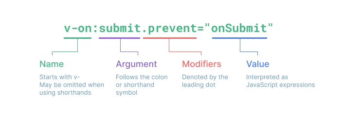

# 最新

## ref()

在组合式API中,推荐使用**ref()**函数来声明响应式状态.

```ts
// ref()函数的定义,ref本质是RefImpl类的工厂函数
export function ref(rawValue: unknown) {
  // 如果已经是Ref对象,直接返回
  if (isRef(rawValue)) {
    return rawValue
  }
  
  // 创建并返回一个新的RefImpl类的实例
  return new RefImpl(rawValue)
}
```

我们来看RefImpl类

```ts
class RefImpl<T = any> {
  // 保存的值
  _value: T,
  // 一个Dep对象,保存该RefImpl实例的订阅者
  dep: Dep = new Dep()
  
  // 构造函数,设置_value属性
  constructor(value: T) {
    this._value = typeof value === 'object' ? reactive(value) : value
  }
  
  // value属性是一对getter和setter函数,并不是真正的属性
  // value对应的getter函数
  get value() {
    // 依赖追踪,记录此时的观察者为该Ref对象的订阅者
    this.dep.track()
    return this._value
  }
  
  // value对应的setter函数
  set value(newValue) {
    // 对比的是原始值
    const oldValue = toRaw(this._value)
    newValue = toRaw(newValue)
    // 如果原始值不一样
    if (oldValue !== newValue) {
      // 设置新值
      this._value = typeof newValue === 'object' ? reactive(newValue) : newValue
      // 触发此ref对象对应的观察者
      this.dep.trigger()
    }
  }
}
```

至此,ref()函数执行完毕.

## Dep类

Dep是RefImpl的属性,我们来看Dep类的具体实现.

```ts
export class Dep {
  // 连接着该dep对象和一个正在运行的effect函数
  // 什么时候用呢?
  activeLink?: Link = undefined
  // 订阅者双向链表的尾部
  // 一个computed属性订阅了reactive的一个属性,为什么reactive这个属性的subs没有那个computed?
  subs?: Link = undefined
  // 构造函数
	constructor(public computed?: ComputedRefImpl | undefined) {
  }
  
  // 追踪函数
  track(): Link | undefined {
    // 如果没有正在运行的订阅者,则不需要追踪依赖,直接返回
    if (!activeSub) {
      return
    }
    
    let link = this.activeLink
    if (link === undefined || link.sub !== activeSub) {
      link = this.activeLink = {
        dep: this,
        sub: activeSub,
        
        prevDep: undefined,
        nextDep: undefined,
        prevSub: undefined,
        nextSub: undefined,
        prevActiveLink: undefined,
      }
      // 将link添加到activeSub.deps链表中
      if (!activeSub.deps) {
        activeSub.deps = activeSub.depsTail = link
      } else {
        link.prevDep = activeSub.depsTail
        activeSub.depsTail!.nextDep = link
        activeSub.depsTail = link
      }
    } else if (link.version === -1) {
      
    }
    
    return link
  }
  
  // 触发函数
  trigger(): void {
    this.notify()
  }
  
  // 通知函数
	notify(): void {
    for (let link = this.subs; link; link = link.prevSub) {
      link.sub.notify()
    }
  }
}
```

### Link的定义

```ts
export interface Link {
  // 依赖(发布者)
  dep: Dep
  // Subscriber订阅者是一种跟踪（或订阅）依赖列表的类型
  sub: Subscriber
  
  // 双指针链表
	prevDep?: Link
  nextDep?: Link
  
  prevSub?: Link
  nextSub?: Link
  
  // 上一个活跃的Link
  prevActiveLink?: Link
}

// Subscriber订阅者是一种跟踪（或订阅）依赖列表的类型
export interface Subscriber {
  // 双向链表的头部
  deps?: Link
  // 双向链表的尾部
  depsTail?: Link
  // 通知方法
  notify(): void
}

// 正在进行操作的订阅者
export let activeSub: Subscriber | undefined
```

## reactive()

对于原始值,ref()在构造函数中会设置this.\_value = value,但是对于对象类型,则会设置this.\_value = reactive(value),这和单独使用**reactive()**函数时是同一个函数,我们来看reactive()函数的实现.

```ts
// 非常重要的模块变量,保存全部reactive()定义的依赖关系
const targetMap = new WeakMap<object, Map<string, Dep>>()
// 非常重要的模块变量,保存全部reactive定义的对象到proxy的映射.
const proxyMap = new WeakMap<object, Proxy>()

// 追踪函数
function track(target: object, key: string): void {
  // 如果没有正在运行的订阅者,则不需要追踪依赖,直接返回
  if (!activeSub) {
    return
  }
  
  let depsMap = targetMap.get(target)
  if (!depsMap) {
    targetMap.set(target, (depsMap = new Map()))
  }
  let dep = depsMap.get(key)
  if (!dep) {
    depsMap.set(key, (dep = new Dep()))
  }
  // track()全局函数,是先找到target[key]对应的dep,在执行dep.track()
  // 本质和ref的get方法是一致的,都是执行dep.track()
  dep.track()
}

// 触发函数,本质也是找到target[key]对应的Dep,然后触发dep对应的trigger函数
function trigger(target: object, key: string): void {
  // 获取target[key]的订阅者列表
  const depsMap = targetMap.get(target)
  if (!depsMap) {
    return
  }
  
  let deps: Dep[] = []
  deps.push(depsMap.get(key))
  // 遍历deps
  for (const dep of deps) {
    dep.trigger()
  }
}

function reactive(target: object) {
  // 如果target不是对象,直接返回
  if (!(typeof target === 'object' && target !== null)) {
    return target
  }
  // 如果target已经被可观察化,直接返回
  // 由此可以看出,proxyMap保存着全局响应式对象
	if (proxyMap.has(target)) {
    return proxyMap.get(target)
  }
  
  // 设置拦截器
  const baseHandlers = {
    // get
    get(target: object, key: string): any {
      // 收集此时的观察者
      track(target, key)
      // 返回的依然是响应式的
      return reactive(target[key])
    },
    // set
    set(target: object, key: string, value: unknown) {
      // 对比的是原始值
      const oldValue = toRaw(target[key])
      newValue = toRaw(value)
      // 如果原始值不一样
      if (oldValue !== newValue) {
        // 设置新值
        target[key] = newValue
        // 触发target[key]对应的观察者
        trigger(target, key)
      }
    }
  }
  // 创建一个Proxy对象,并返回
	const proxy = new Proxy(target, baseHandlers)
  proxyMap.set(target, proxy)
  return proxy
}
```

reactive执行完毕.

貌似ref的观察者在它自己内部保存,包括dep,和dep内部的track和trigger方法.

reactive()没有直接使用Dep类,而是自己保存在**proxyMap**,,将依赖保存在全局**targetMap**,触发方法则是全局的track和全局的trigger.

## computed()

计算属性,参数为getter函数,或一个对象,包含get和set函数.

本质就是一个和ref()类似的对象.

```ts
export function computed(getterOrOptions) {
  // 获取getter,setter
  let getter
  let setter
  if (typeof getterOrOptions === 'function') {
    getter = getterOrOptions
  } else {
    getter = getterOrOptions.get
    setter = getterOrOptions.set
  }
  
  // 返回一个ComputedRefImpl实例
  return new ComputedRefImpl(getter, setter)
}
```

我们来看ComputedRefImpl类

```ts
export class ComputedRefImpl implements Subscriber {
  // 保存的值
  _value: any
  // 一个Dep对象,保存该ComputedRefImpl实例的订阅者
  dep: Dep = new Dep(this)
  // ComputedRefImpl实例本身也是一个观察者,可以订阅其它依赖(发布者)
  deps?: Link = undefined
  depsTail?: Link = undefined
  
  // 构造函数
  constructor(public fn: Function, private setter: Function | undefined) {
  }
  
  // value和RefImpl类一样,也是一组getter/setter函数
  // 和RefImpl基本一致
  get value() {
    this.dep.track()
    // 获取最新值
		refreshComputed(this)
    
    return this._value
  }
  
  // value的setter函数
  // 和RefImpl非常不一致
  set value(newValue) {
    if (this.setter) {
      this.setter(newValue)
    }
  }
}

export interface Subscriber {
  // 双向链表的头部
  deps?: Link
  // 双向链表的尾部
  depsTail?: Link
  // 通知方法
  notify(): void
}
```

我们来看refreshComputed函数

```ts
export function refreshComputed(computed: ComputedRefImpl) {
  
  // 如果依赖项没有变化,直接返回
	if (computed.globalVersion === globalVersion) {
    return
  }
  
  const dep = computed.dep
  
  const prevSub = activeSub
  // 设置activeSub
  activeSub = computed
  
  // 获取最新值
  const value = computed.fn(computed._value)
  if (computed._value !== value) {
    computed._value = value
  }
  
  // 执行完毕,恢复activeSub
  activeSub = prevSub
}
```

## watch

watch太复杂了,暂时不看.

## effectScope.ts文件

effectScope.ts是Vue3响应式系统的核心文件之一,它负责管理副作用(computed, watch)的作用域.

```ts
// 模块作用域变量,当前活跃的EffectScope实例
export let activeEffectScope: EffectScope | undefined

// EffectScope类的定义
export class EffectScope {
  // 管理的effect数组
  effects: ReactiveEffect[] = []
  // 当前EffectScope实例停止时的回调函数数组
  cleanups: (() => void)[] = []
  
  // 当前EffectScope实例是否是活跃状态
  private _active = true
  // 当前EffectScope是否是暂停状态
  private _isPaused = false
  
  // 父实例
  parent: EffectScope | undefined
  // 子实例
  scopes: EffectScope[] | undefined
  // 当前实例在父实例scopes的索引
  private index: number | undefined
  
  // 构造函数
	constructor(public detached = false) {
    this.parent = activeEffectScope
    // 如果是独立的,或者没有活跃的EffectScope实例,直接返回
    if (detached || !activeEffectScope) {
      return
    }
    
    if (!activeEffectScope.scopes) {
      activeEffectScope.scopes = []
    }
    // 将当前EffectScope实例添加到activeEffectScope实例的scopes数组中
    activeEffectScope.scopes.push(this)
    this.index = activeEffectScope.scopes.length - 1
  }
  
  // active属性,是一个getter
  get active(): boolean {
    return this._active
  }
  
  // 暂停函数
  pause(): void {
    
  }
  
  // 恢复函数
  resume(): void {
    
  }
  
  // 在当前EffectScope实例下,运行一个函数,所有在这个函数内创建的响应式副作用(ref,computed,watch)会被这个EffectScope实例管理
  run(fn) {
    if (!this._avtive) {
      return
    }
    
    const currentEffectScope = activeEffectScope
    try {
      activeEffectScope = this
      return fn()
    } finally {
      activeEffectScope = currentEffectScope
    }
  }
  
  // 只应该在非独立EffectScope实例下运行
  on(): void {
    activeEffectScope = this
  }
  
  // 只应该在非独立EffectScope实例下运行
  off(): void {
    activeEffectScope = this.parent
  }
  
  // EffectScope实例的停止函数
  stop(): void {
    if (!this._active) {
      return
    }
    
    // xxx
  }
  
  
  
}

// EffectScope类的工厂函数
export function effectScope(detached?: boolean): EffectScope {
  return new EffectScope(detached)
}

// 获取当前活跃的EffectScope实例
export function getCurrentScope(): EffectScope | undefined {
  return activeEffectScope
}

// 为当前活跃的EffectScope实例添加一个停止时的回调函数
export function onScopeDispose(fn: () => void): void {
  if (activeEffectScope) {
    activeEffectScope.cleanups.push(fn)
  }
}
```


## Vue的初始化过程

### createApp()

创建一个Vue实例.

```ts
// 唯一的参数是根组件
function createApp(rootComponent: Component): App
```

我们传入createApp的对象实际上是一个组件,每个应用都需要一个根组件,其它组件将作为其子组件.

Vue实例必须在调用了.mount()方法后才会渲染出来,不再支持Vue2类似的el属性,需要手动执行.mount()方法.

```ts
import { createApp } from 'vue'

// 创建Vue实例
const app = createApp({})
// 手动挂载
app.mount('#app')
```

Vue将被渲染到指定元素里面,而不是替换目标元素.

### app.mount()

在Vue3的mount时，最外层的#app并没有被替换，Vue将内容添加到#app的子元素下，而不是替换#app。

### app.use()

安装一个插件.

### nextTick()

等待下一次DOM更新刷新的工具方法.

```ts
function nextTick(callback?: () => void): Promise<void>
```

### setup()

setup()钩子是在组件中使用组合式API的入口,通常只在以下情况使用.

- 需要在非单文件组件中使用组合式API
- 在基于选项式API的组件中集成基于组合式API的代码.

对于结合单文件组件使用的组合式API,推荐使用\<script setup\>以获得更加简洁的语法.

在从模板和选项式写法中访问ref时,会**自动浅层解包**,因此无需再模板中为它写.value.

setup()自身不可以访问组件实例,在setup()中访问this是undefined.可以在选项式API中访问组合式API暴露的值,但反过来不行.

setup()应该同步的返回一个对象.

#### setup()如何访问props

setup()的第一个参数是组件的props,

```ts
export default {
  props: {
    title: {
      type: String,
      required: true,
    }
  },
  setup(props) {
    console.log(props.title)
  },
}
```

- props.xxx保持响应性
- 如果解构了props对象,解构出的变量将失去响应性.可以使用toRef()函数避免这种情况.

#### setup的上下文

上下文this为undefined,但第二个参数为传递进来的上下文,

```ts
export default {
  setup(props, context) {
    context.emit()
  }
}
```

### 接着看createApp()的具体实现

```ts
// 全局API
export const createApp = (...args) => {
  // 创建
  const app = ensureRenderer().createApp(...args)
  
  app.mount = (containerOrSelector: HTMLElement | string) => {
    // 如果已经绑定,直接返回
    if (isMounted) {
      return
    }
    
    // 获取要挂载的DOM元素
    const container = getContainer(containerOrSelector)
    // 创建对应的vnode
    const vnode = createVNode(container)
    
    // 渲染函数
    render(vnode, container)
    isMounted = true
    
    return vnode.component.proxy
  }
  
  // 返回创建的app
  return app
}
```

我们来看render()

```ts
// 渲染函数,相当于Vue2的patch函数
const render = (vnode, container) => {
  // 1. 如果新node为null,直接销毁旧node
  if (vnode === null) {
    if (container._vnode) {
      unmount(container._vnode)
    }
  } else {
    // 2. 新node不是null
    patch(container._vnode, vnode, container)
  }
  // 更新container
  container._vnode = vnode
  
  // 执行其它回调,比如watch定义的
  if (isFlushing) {
    isFlushing = true
    flushPreFlushCbs()
    flushPostFlushCbs()
    isFlushing = false
  }
}
```

### patch的具体实现

```ts
// n1为oldVnode,n2为newVnode
const patch = (n1, n2, container) {
  if (n1 === n2) {
    return
  }
  
  
}
```


## Vue3官网学习

### 简介

```ts
import {createApp} from '../../dist/vue.esm-browser.js'

const compoent = {
  template: `<button @click="count++">{{count}}</button>`,
  data() {
    return {
      count: 0,
    }
  },
}

const app = createApp(compoent)
app.mount(document.body)
```

#### script setup

是语法糖,定义的顶层变量可以在模板中直接使用.

```ts
import { createApp, ref } from '../../dist/vue.esm-browser.js'

const compoent = {
  template: `<button @click="inc">{{count}}</button>`,
  setup() {
    const count = ref(0)
    function inc() {
      count.value++
    }

    return {
      count,
      inc,
    }
  },
}

const app = createApp(compoent)
app.mount(document.body)
```

选项式API和组合式API只是同一个底层系统所提供的两套不同的接口.实际上,选项式API是在组合式API的基础上实现的!

### 模板语法

在底层机制中,Vue会将模板编译成高度优化的JavaScript代码,结合响应式系统,当应用状态变更时,Vue能够智能地推算出需要重新渲染的组件的最少数量,并应用到最少得DOM操作.

#### Attribute绑定

```vue
<template>
	<div :id="dynamicId"></div>
	<!--同名简写,等效于<div :id="id"></div>-->
	<div :id></div>
</template>
```




### 响应式基础

```ts
export default {
  data() {
    return {
      someObject: {}
    }
  },
  mounted() {
    const newObject = {}
    this.someObject = newObject

    console.log(newObject === this.someObject) // false
  }
}
```

当你在赋值后再访问 `this.someObject`，此值已经是原来的 `newObject` 的一个响应式代理。**与 Vue 2 不同的是，这里原始的 `newObject` 不会变为响应式：请确保始终通过 `this` 来访问响应式状态。**

#### 声明方法

你不应该在定义 `methods` 时使用箭头函数，因为箭头函数没有自己的 `this` 上下文。

#### 有状态方法

方法不应该有状态,否则多个组件实例会相互影响.

```ts
import { debounce } from 'lodash-es'

export default {
  methods: {
    // 使用 Lodash 的防抖函数
    click: debounce(function () {
      // ... 对点击的响应 ...
    }, 500)
  }
}
```

改为这样,

```ts
export default {
  created() {
    // 每个实例都有了自己的预置防抖的处理函数
    this.debouncedClick = _.debounce(this.click, 500)
  },
  unmounted() {
    // 最好是在组件卸载时
    // 清除掉防抖计时器
    this.debouncedClick.cancel()
  },
  methods: {
    click() {
      // ... 对点击的响应 ...
    }
  }
}
```

#### 生命周期

Vue2和Vue3基本一致,除了Vue3的最后2个改为了beforeUnmount和unmount.

### watch侦听器

watch默认是浅层的,被侦听的属性,仅在被赋予新值时,才会触发回调函数,而嵌套属性的改变不会触发.如果想侦听所有嵌套的变更,需要使用深层侦听器:

```ts
export default {
  watch: {
    someObject: {
      handler(newValue, oldValue) {
        // 注意：在嵌套的变更中，
        // 只要没有替换对象本身，
        // 那么这里的 `newValue` 和 `oldValue` 相同
      },
      deep: true
    }
  }
}
```

默认情况下,侦听器回调在父组件更新之后,所属组件的DOM更新之前被调用.此如果在侦听器回调中访问所属组件的DOM,那么DOM将处于更新前的状态.

可以配置在组件更新后触发.

在组合式API中,可以直接侦听ref类型,watch默认为深层侦听器.

#### watchEffect

参数为一个函数,自动收集依赖.`watchEffect` 仅会在其**同步**执行期间，才追踪依赖。在使用异步回调时，只有在第一个 `await` 正常工作前访问到的属性才会被追踪。

### 模板引用

在选项式中使用this.$refs.xxx,在组合式API中使用Vue3.5新增的useTemplateRef API,

```vue
<script setup>
import { useTemplateRef, onMounted } from 'vue'

// 第一个参数必须与模板中的 ref 值匹配
const input = useTemplateRef('my-input')

onMounted(() => {
  input.value.focus()
})
</script>

<template>
  <input ref="my-input" />
</template>
```

在3.5之前使用:

```vue
<script setup>
import { ref, onMounted } from 'vue'

// 声明一个 ref 来存放该元素的引用
// 必须和模板里的 ref 同名
const input = ref(null)

onMounted(() => {
  input.value.focus()
})
</script>

<template>
  <input ref="input" />
</template>
```

### 组件基础

在单文件组件中，推荐为子组件使用 `PascalCase` 的标签名

####传递props

在组合式API中使用defineProps,`defineProps` 是一个仅 `<script setup>` 中可用的编译宏命令，并不需要显式地导入。声明的 props 会自动暴露给模板。`defineProps` 会返回一个对象，其中包含了可以传递给组件的所有 props：

```vue
<!-- BlogPost.vue -->
<script setup>
defineProps(['title'])
const props = defineProps(['title'])
console.log(props.title)
</script>

<template>
  <h4>{{ title }}</h4>
</template>
```

如果你没有使用 `<script setup>`，props 必须以 `props` 选项的方式声明，props 对象会作为 `setup()` 函数的第一个参数被传入：

```ts
export default {
  props: ['title'],
  setup(props) {
    console.log(props.title)
  }
}
```

#### 触发事件

我们可以通过 [`defineEmits`](https://cn.vuejs.org/api/sfc-script-setup.html#defineprops-defineemits) 宏来声明需要抛出的事件：

和 `defineProps` 类似，`defineEmits` 仅可用于 `<script setup>` 之中，并且不需要导入，它返回一个等同于 `$emit` 方法的 `emit` 函数。它可以被用于在组件的 `<script setup>` 中抛出事件，因为此处无法直接访问 `$emit`：

```vue
<script setup>
const emit = defineEmits(['enlarge-text'])

emit('enlarge-text')
</script>
```

如果你没有在使用 `<script setup>`，你可以通过 `emits` 选项定义组件会抛出的事件。你可以从 `setup()` 函数的第二个参数，即 setup 上下文对象上访问到 `emit` 函数：

```ts
export default {
  emits: ['enlarge-text'],
  setup(props, ctx) {
    ctx.emit('enlarge-text')
  }
}
```

### props

响应式Props解构,Vue 的响应系统基于属性访问跟踪状态的使用情况。例如，在计算属性或侦听器中访问 `props.foo` 时，`foo` 属性将被跟踪为依赖项。

```ts
const { foo } = defineProps(['foo'])

watchEffect(() => {
  // 在 3.5 之前只运行一次
  // 在 3.5+ 中在 "foo" prop 变化时重新执行
  console.log(foo)
})
```

在 3.4 及以下版本，`foo` 是一个实际的常量，永远不会改变。在 3.5 及以上版本，当在同一个 `<script setup>` 代码块中访问由 `defineProps` 解构的变量时，Vue 编译器会自动在前面添加 `props.`。因此，上面的代码等同于以下代码：

```ts
const props = defineProps(['foo'])

watchEffect(() => {
  // `foo` 由编译器转换为 `props.foo`
  console.log(props.foo)
})
```

#### 将解构的 props 传递到函数中

当我们将解构的 prop 传递到函数中时，例如：

```ts
const { foo } = defineProps(['foo'])

watch(foo, /* ... */)
```

这并不会按预期工作，因为它等价于 `watch(props.foo, ...)`——我们给 `watch` 传递的是一个值而不是响应式数据源。实际上，Vue 的编译器会捕捉这种情况并发出警告。

与我们可以使用 `watch(() => props.foo, ...)` 侦听普通 prop 类似，我们也可以通过将其包装在 getter 中来侦听解构的 prop：

```ts
watch(() => foo, /* ... */)
```

此外，当我们需要传递解构的 prop 到外部函数中并保持响应性时，这是推荐做法：

```ts
useComposable(() => foo)
```

外部函数可以调用 getter (或使用 [toValue](https://cn.vuejs.org/api/reactivity-utilities.html#tovalue) 进行规范化) 来追踪提供的 prop 变更。例如，在计算属性或侦听器的 getter 中。

### 组件事件

使用$emit触发,

- setup(props, context),使用context.emit
- 模板和选项式写法中使用$emit,需要使用emits字段声明会触发的方法.
- setup单文件使用defineEmits宏

### v-model

v-model可以在组件上实现双向绑定,

在原生组件上和Vue2行为一致,默认使用value属性和input事件.

在组件上,和Vue2不一样,默认使用modelValue属性,监听update:modelValue事件.

```vue
<CustomInput
  :model-value="searchText"
  @update:model-value="newValue => searchText = newValue"
/>
```

```vue
<!-- CustomInput.vue -->
<script>
export default {
  props: ['modelValue'],
  emits: ['update:modelValue']
}
</script>

<template>
  <input
    :value="modelValue"
    @input="$emit('update:modelValue', $event.target.value)"
  />
</template>
```

现在 `v-model` 可以在这个组件上正常工作了：

```vue
<CustomInput v-model="searchText" />
```

另一种在组件内实现 `v-model` 的方式是使用一个可写的，同时具有 getter 和 setter 的 `computed` 属性。`get` 方法需返回 `modelValue` prop，而 `set` 方法需触发相应的事件：

```vue
<!-- CustomInput.vue -->
<script>
export default {
  props: ['modelValue'],
  emits: ['update:modelValue'],
  computed: {
    value: {
      get() {
        return this.modelValue
      },
      set(value) {
        this.$emit('update:modelValue', value)
      }
    }
  }
}
</script>

<template>
  <input v-model="value" />
</template>
```

组件上的 `v-model` 也可以接受一个参数：

```vue
<MyComponent v-model:title="bookTitle" />
```

在这种情况下，子组件应该使用 `title` prop 和 `update:title` 事件来更新父组件的值，而非默认的 `modelValue` prop 和 `update:modelValue` 事件：

```vue
<!-- MyComponent.vue -->
<script>
export default {
  props: ['title'],
  emits: ['update:title']
}
</script>

<template>
  <input
    type="text"
    :value="title"
    @input="$emit('update:title', $event.target.value)"
  />
</template>
```

### 插槽

和Vue2一致.

### 组合式函数

在Vue应用的概念中,组合式函数是一个利用Vue的组合式API来封装和复用**有状态逻辑**的函数.

- 无状态: 普通工具函数,比如**debounce防抖函数**和**throttle节流函数**,**copyTextToClipboard复制文本到剪贴板**.
- 有状态: 负责管理**会随时间而变化**的状态,比如跟踪当前鼠标在页面中的位置.

正常逻辑.

```ts
const ComponentChild = {
  name: 'ComponentChild',
  props: {
    count: {
      type: Number,
      require: true,
    },
  },
  emits: [
    'update:count',
  ],
  template: `<div style="display: flex;">
    <span>x: {{x}}</span>
    <span>y: {{y}}</span>
  </div>`,
  setup() {
    const x = ref(0)
    const y = ref(0)

    function update(event) {
      x.value = event.pageX
      y.value = event.pageY
    }

    onMounted(() => {
      window.addEventListener('mousemove', update)
    })

    onUnmounted(() => {
      window.removeEventListener('mousemove', update)
    })

    return {
      x,
      y,
    }
  },
}
```

我们现在可以把这个逻辑抽出来,作为公共函数,类似mixin.

#### 命名

驼峰命名,以use开头.

####输入参数

####返回值

返回一个包含多个ref的普通的非响应式对象,这样该对象在组件中被解构为ref之后仍可以保持响应性.

如果你更希望以对象属性的形式来使用组合式函数中返回的状态，你可以将返回的对象用 `reactive()` 包装一次，这样其中的 ref 会被自动解包，例如:

```ts
const mouse = reactive(useMouse())
// mouse.x 链接到了原来的 x ref
console.log(mouse.x)
```

#### 使用限制

- 组合式函数只能在 `<script setup>` 或 `setup()` 钩子中被调用。
- 它们也只能被**同步**调用.
- 在某些情况下，你也可以在像 `onMounted()` 这样的生命周期钩子中调用它们.

这些限制很重要，因为这些是 Vue 用于确定当前活跃的组件实例的上下文。访问活跃的组件实例很有必要，这样才能：

1. 将生命周期钩子注册到该组件实例上
2. 将计算属性和监听器注册到该组件实例上，以便在该组件被卸载时停止监听，避免内存泄漏。

### 路由

```ts
export interface IRouterParams {
  routes: object,
  updateCallback: Function,
}

export class Router {

  routes: object
  updateCallback: Function

  constructor(params: IRouterParams) {

    this.routes = params.routes
    this.updateCallback = params.updateCallback
    this.updateBind = this.update.bind(this)

    window.addEventListener('popstate', this.updateBind)
  }

  push(pathname: string) {
    history.pushState(null, '', pathname)
    this.updateCallback(this.getComponent())
  }

  replace(pathname: string) {
    history.replaceState(null, '', pathname)
    this.updateCallback(this.getComponent())
  }

  getComponent() {
    return this.routes[location.pathname] || this.routes['*']
  }

  update() {
    this.updateCallback(this.getComponent())
  }

  destroy() {
    window.removeEventListener('popstate', this.updateBind)
  }
}
```


### 状态管理

使用内置API管理.

### \<script setup\>

\<script setup\>是在单文件组件(SFC)中使用组合式API的编译时语法糖.

- 导入的组件可以直接使用
- 

#### 基本语法

要启用该语法,需要在\<script\>代码块上添加setup标识:

```vue
<script setup>
console.log('hello script setup')
</script>
```

里面的代码会被编译成组件setup()函数的内容,并自动导出顶层定义的变量.这意味着与普通\<script\>只在组件被首次引入的时候执行一次不同,\<script\>中的代码会在**每次组件实例被创建**的时候执行.

#### 顶层的绑定会被暴露给模板和选项式语法

当使用\<script setup\>的时候,任何在\<script setup\>声明的顶层的绑定(包括变量,函数,以及import导入的内容)都能在模板中直接使用:

```vue
<script setup>
// 变量
const msg = 'Hello!'

// 函数
function log() {
  console.log(msg)
}
</script>

<template>
  <button @click="log">{{ msg }}</button>
</template>
```

#### defineProps()和defineEmits()

```vue
<script setup>
const props = defineProps({
  foo: String
})

const emit = defineEmits(['change', 'delete'])
// setup 代码
</script>
```

- `defineProps` 和 `defineEmits` 都是只能在 `<script setup>` 中使用的**编译器宏**。他们不需要导入，且会随着 `<script setup>` 的处理过程一同被编译掉。

- `defineProps` 接收与 `props` 选项相同的值，`defineEmits` 接收与 `emits` 选项相同的值。

- 在 Vue 3.5 及以上版本中，从 `defineProps` 返回值解构出的变量是响应式的。当在同一个 `<script setup>` 块中的代码访问从 `defineProps` 解构出的变量时，Vue 的编译器会自动在前面添加 `props.`

  ```ts
  const { foo } = defineProps(['foo'])
  
  watchEffect(() => {
    // 在 3.5 之前仅运行一次
    // 在 3.5+ 版本中会在 "foo" prop 改变时重新运行
    console.log(foo)
  })
  ```

  以上编译成以下等效内容：

  ```ts
  const props = defineProps(['foo'])
  
  watchEffect(() => {
    // `foo` 由编译器转换为 `props.foo`
    console.log(props.foo)
  })
  ```

#### defineModel()

这个宏可以用来声明一个双向绑定props,通过父组件的v-model来使用,底层原理:

- 一个名为modelValue的props
- 一个名为update:modelValue的事件

```vue
<script setup>
const model = defineModel()
</script>

<template>
  <input v-model="model" />
</template>
```

编译后:

```vue
<!-- Child.vue -->
<script setup>
const props = defineProps(['modelValue'])
const emit = defineEmits(['update:modelValue'])
</script>

<template>
  <input
    :value="modelValue"
    @input="emit('update:modelValue', $event.target.value)"
  />
</template>
```

### 更新算法

- Vue2: 双端diff
- Vue3: 最长公共子序列,更高效.


# markRaw

将一个对象标记为不需要被Vue的响应式系统管理和影响.

```ts
export function markRaw(value) {
  value.__v_skip = true
  return value
}
```

# provide

提供一个数据,保存在createApp()创建的App实例上,即app.\_context.provides对象上

```ts
function provide(key, value) {
  app._context.provides[key] = value
}
```

# inject

获取一个数据

```ts
function inject(key) {
  return app._context.provides[key]
}
```

# Vue3做了哪些优化?

- vue3的diff算法相比Vue2增加了**静态标记**,查找可能会变化的元素.静态提升,对不参加更新的元素,渲染时复用.
- vue3源码支持tree shanking.

# Vue3响应式实现

Vue3的响应式系统在源码层面，架构有很大改变，Vue3的源码架构使用了分包的模式，将不同功能分为不同包，各个包可以独立使用和替换，其中响应式相关的包放在packages/reactivity包中。Vue3的响应式底层实现即为该包实现的，是通过组合式函数实现的，Vue3的组件对象的setup()选项，或者Vue3的单文件组件\<script setip\>可以使用这些组合式函数来生命响应式属性。Vue3依然支持选项式写法，根据Vue3的官网介绍，Vue3的选项式写法的底层是组合式函数，即Vue3的选项式写法是基于组合式函数的封装实现。

在Vue3的package/reactivity包中，原理依然是proxy拦截 + 观察者模式，有4个底层定义：

- targetDep，存储程序中全部的依赖关系
- effect函数+activeEffect全局属性，运行一个观察者函数，在运行过程中会自动收集依赖
- track函数，追踪对象的某个属性，即如果此时activeEffect存在，则将activeEffect函数存在该属性的dep属性中，dep属性存储的该属性的观察者函数集合
- trigger函数，触发对target的key属性的更新，遍历并执行该属性的dep对应的set集合中的所有effect函数。

基于以上3个底层概念，Vue3向用户暴露了3个函数定义，用来定义响应式属性。

- reactive：使用new Proxy(raw, handler)包装原始对象，handle为拦截方法，当我们get属性时，会使用Reflect.get来获取属性，并调用track()追踪依赖；当set属性时，如果新旧属性不一致，则触发trigger函数，调用该属性的dep存储的所有观察者函数。
- ref：ref本质是对reactive的包装，将传入参数包裹在一个新对象的value属性中，返回对新对象调用reactive后的返回值。
- computed：参数为一个getter函数， 内部定义了一个ref对象，执行effect(() => (ref.value = getter()))给ref.value赋值，并自动收集依赖，然后返回ref对象。

响应式系统实现了。

effect函数和scheduler机制的细节.

Vue3使用Proxy代替Object.defineProperty，因为Proxy可以直接监听对象和数组的变化，并且有多达13种拦截方法。


