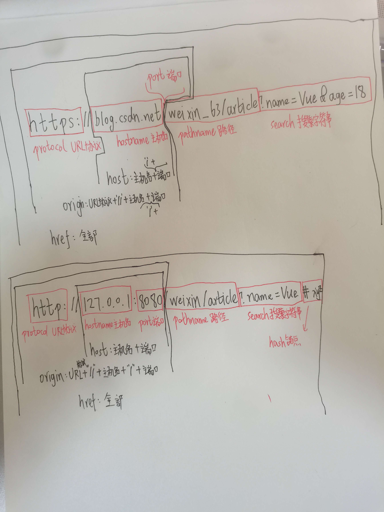

# URL统一资源定位符

# 什么是URL？

本文讨论统一资源定位符(URL)，并解释了他们是什么。

URL是Web中的一个核心概念。他是浏览器用来检索web上公布的任何资源的机制。

# URL结构

URL示例

```
https://developer.mozilla.org
https://developer.mozilla.org/zh-CN/docs/Learn/
https://developer.mozilla.org/zh-CN/search?q=URL

https://blog.csdn.net/weixin_63/article?name=Vue&age=18#xyz
http://127.0.0.1:8080/weixin/article?name=Vue#xyz
```

我们可以将上面的这些网站输入浏览器地址栏来告诉浏览器加载对应的资源。

一个URL由不同的部分组成，其中一些是必须的，一些是可选的。


 

**URL结构只要由6大部分组成**

## 协议


`http` 是协议。它表明了浏览器必须使用何种协议。它通常都是 HTTP 协议或是 HTTP 协议的安全版，即 HTTPS。Web 需要它们二者之一，但浏览器也知道如何处理其他协议，比如 `mailto:`（打开邮件客户端）或者 `ftp:`（处理文件传输），所以当你看到这些协议时，不必惊讶。

Location接口的protocol属性为：协议 + ':'

## 主机名


主机名为域名或IP地址。

Location接口的hostname属性为：主机名

## 端口

`80` 是端口。它表示用于访问 Web 服务器上的资源的技术“门”。如果 Web 服务器使用 HTTP 协议的标准端口（HTTP 为 80，HTTPS 为 443）来授予其资源的访问权限，则通常会被忽略。否则是强制性的。

Location接口的port属性为：端口

## 路径


资源路径，由服务器处理。

Location接口的pathname属性为：路径

## 搜索字符串


`?key1=value1&key2=value2` 是提供给网络服务器的额外参数。这些参数是用 `&` 符号分隔的键/值对列表。在返回资源之前，Web 服务器可以使用这些参数来执行额外的操作。每个 Web 服务器都有自己关于参数的规则，唯一可靠的方式来知道特定 Web 服务器是否处理参数是通过询问 Web 服务器所有者。

Location接口的search属性：搜索字符串

如果不存在,则为'',如果存在,则以?开头

## 锚点


`#SomewhereInTheDocument` 是资源本身的另一部分的锚点。锚点表示资源中的一种“书签”，给浏览器显示位于该“加书签”位置的内容的方向。例如，在 HTML 文档上，浏览器将滚动到定义锚点的位置;在视频或音频文档上，浏览器将尝试转到锚代表的时间。值得注意的是，＃后面的部分（也称为片段标识符）从来没有发送到请求的服务器。

Location接口的hash属性：锚点

如果不存在,则为'',如果存在,则以#开头


