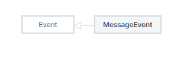

# 不同页面通信

**window.postMessage()** 方法可以安全地实现跨源通信。

```js
otherWindow.postMessage(message, targetOrigin);

const clickMenu = component => {
	console.dir(iframeRef.value)
	iframeRef.value?.contentWindow?.postMessage(component, 'https://jiangjiang0123.cn:444')
}
```

接收方:

```ts
window.addEventListener('message', event => {
	if (event.origin !== 'https://jiangjiang0123.cn') {
		console.log('无效的message')
		console.log(event)
		return
	}

	router.replace(`/${event.data}`)
})

// 通知父网站
window.parent.xxx
```

# MessageEvent

MessageEvent是一个Web API,是message事件的回调参数.



## 属性

### data

可以是任何类型,有消息发送者发送的信息.

### origin

消息发送者的origin

### source

消息发送者本身的引用.

## 方法

无

# window.postMessage

window.postMessage()方法安全的启用跨源通信,允许不同的window对象之间进行通信.

```ts
postMessage(message)
// message可以是任意类型,表示发送的信息
// targetOrigin指定接收窗口的origin.如果省略,则默认为调用该方法的源.
// *是origin的通配符.
postMessage(message, targetOrigin)
```

# 不同页面通信最佳实践

- 接收消息时始终验证消息来源
- 发送消息时
  - 如果知道目标地址,则设置targetOrigin.
  - 如果不知道目标地址,或者为广播类型,则加密数据,只有目标网站可以解密,防止信息泄露.
