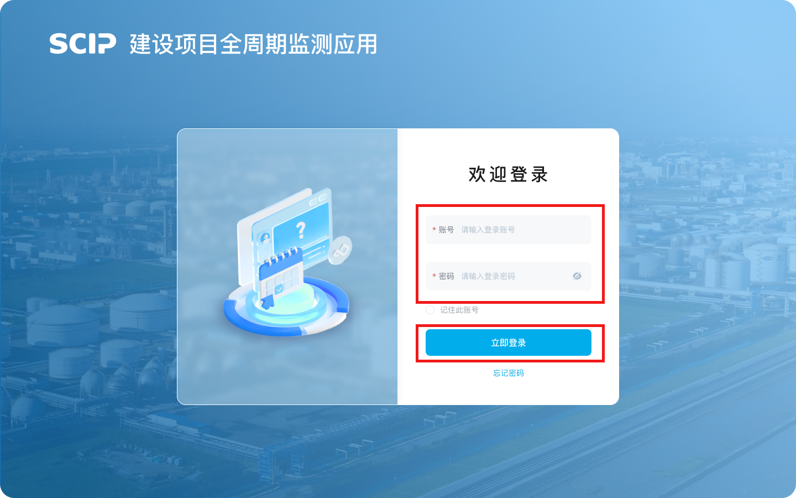
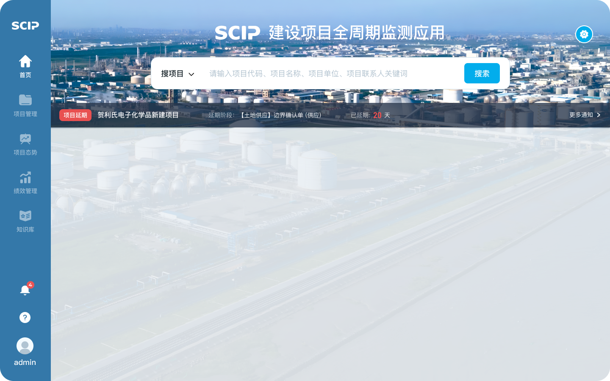
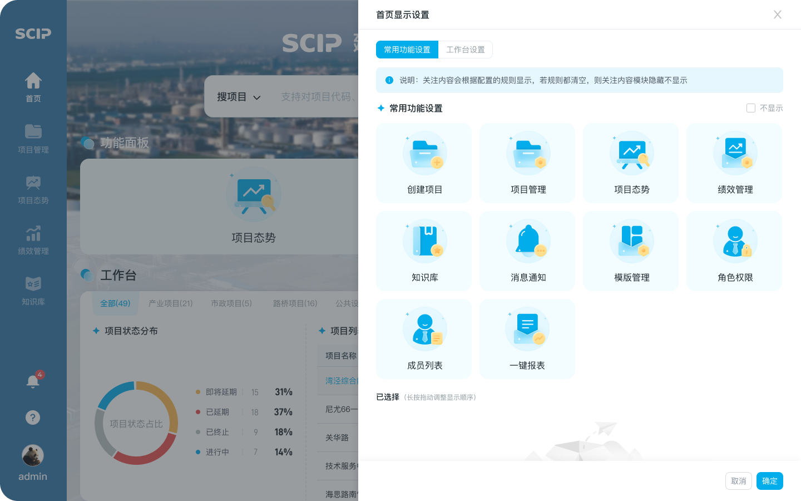
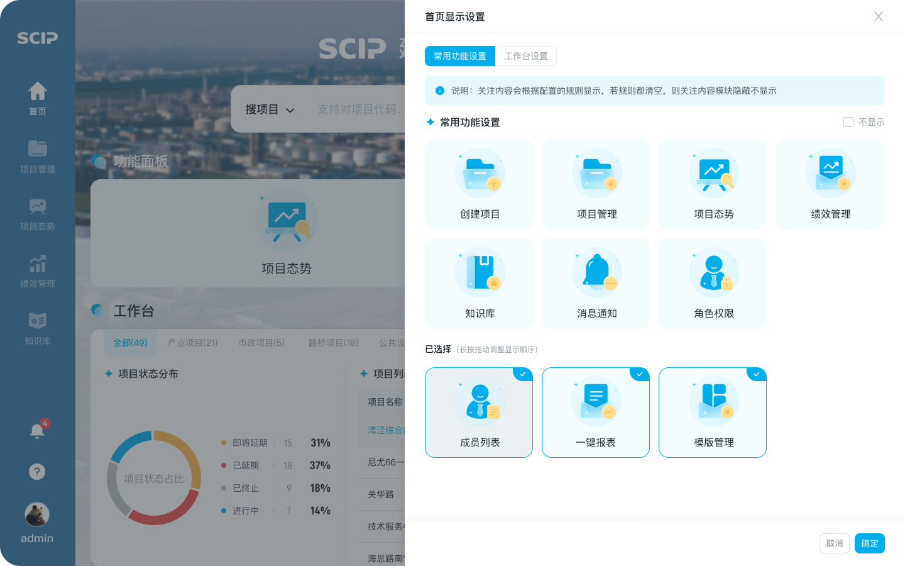
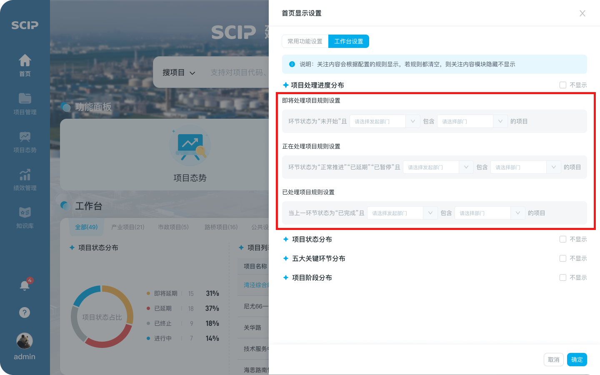

# 显示内容自定义配置

## 第一步：登录系统

- 【登录页面】输入正确的账号、密码，进入【首页】

## 第二步：进入界面设置页面

- 在【首页】界面，点击设置功能，跳转至【界面设置】页面

## 第三步：常用功能设置

- 支持利用长按拖动布局功能模块，支持点选移除功能选择

## 第四步：页面设置规则

- 支持选择不同维度的态势分布情况进行查看，并支持为每一类型的项目设置所需要的规则

