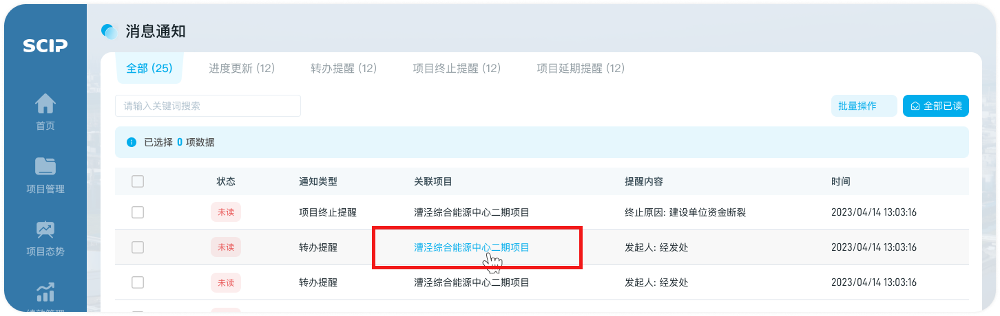
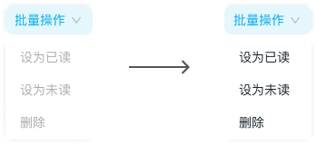
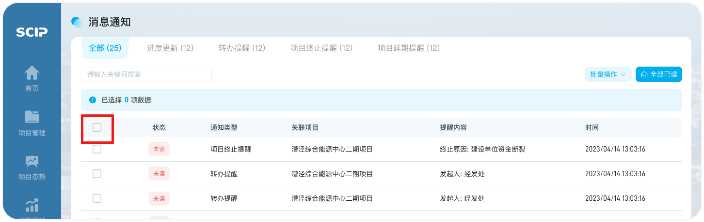
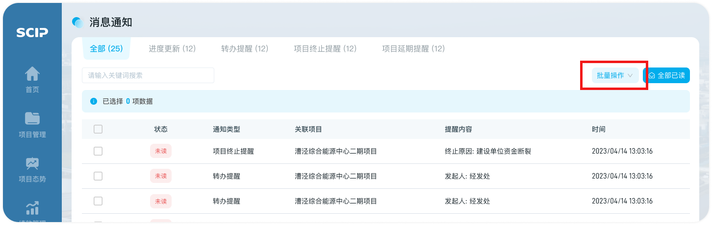
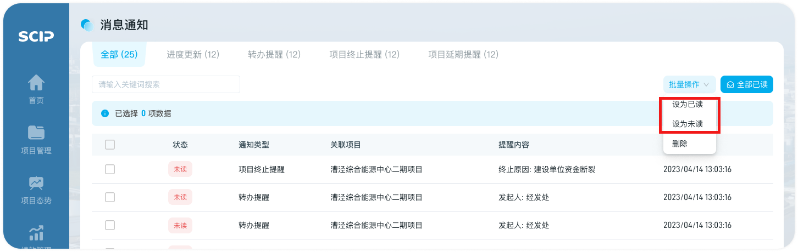
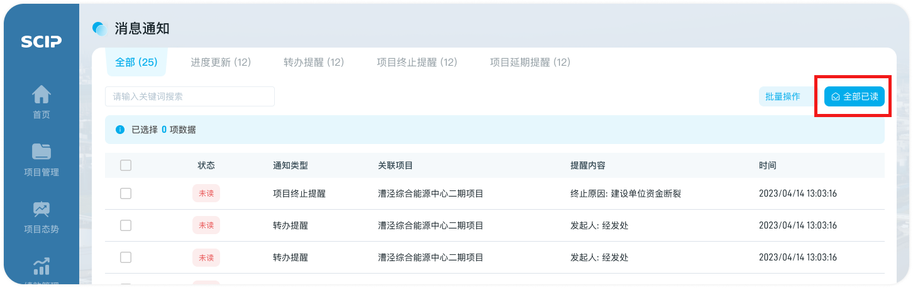

# 消息状态变更

消息状态分为两种：已读、未读

消息状态变更方式一：消息根据是否被用户点开查看而自动标记为已读或者未读

## 第一步：进入入口

- 鼠标悬浮于某一关联项目，项目名称变为蓝色，点击可进入项目详情

## 第二步：消息状态变更

- 点击跳转项目详情后，消息状态由“未读”变更为“已读”

消息状态变更方式二：消息可以根据“批量操作”设为已读或者未读

## 第一步：勾选消息（至少一个）

- 若勾选项目，则“批量操作”内的按钮显示可点击

- 此处可全选当前页的消息，进行批量操作

## 第二步：点击“批量操作”

- 【消息通知】表头右上方的“批量操作”

## 第三步：消息状态变更

- 可对已选择的消息批量设为“已读”、“未读”

消息状态变更方式三：消息可以根据“全部已读”将当前消息类型的所有消息设为已读

## 第一步：点击“全部已读”

- "全部已读"无需勾选，一键将所有消息设为已读

