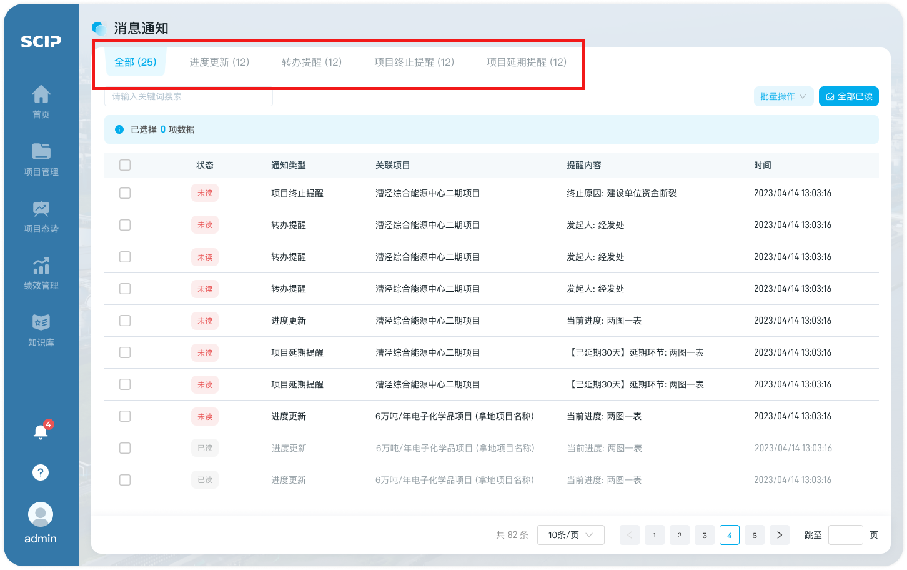

# 消息查看

## 第一步：进入入口

- 【首页-功能面板】可点击【消息通知】快捷入口，进入消息通知页面
- 点击导航【消息通知】，进入消息通知页面

## 第二步：消息筛选/搜索

- 可通过消息类型对消息进行筛选
- 用户可根据”进度更新“”转办提醒“”项目终止提醒“”项目延期提醒“4种消息类型进行快速查找

- 直接在搜索框对消息关键词进行检索
- 可以在消息列表上提供的检索框中输入通知类型、关联项目和提醒内容的关键词进行模糊检索，系统会根据用户输入的关键词返回相关消息

## 第三步：消息详情查看

- 可在【消息通知】列表中直接预览消息内容，点击可进入查看项目详情

