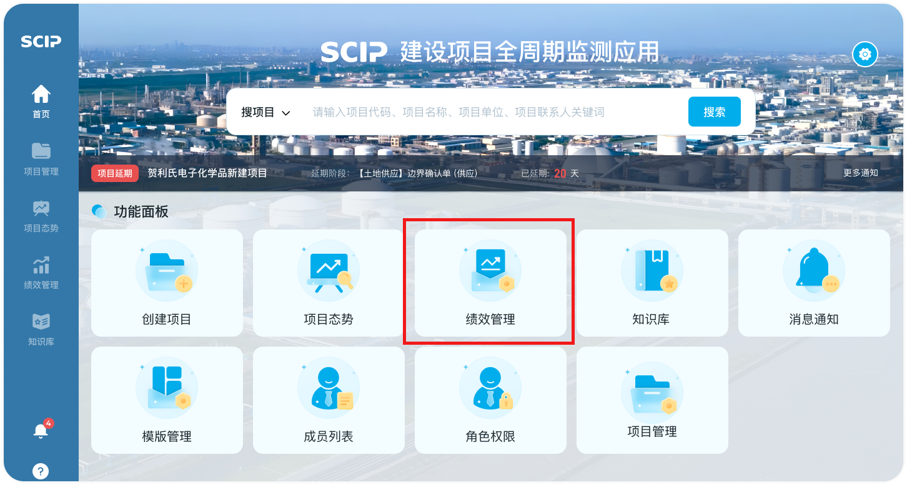
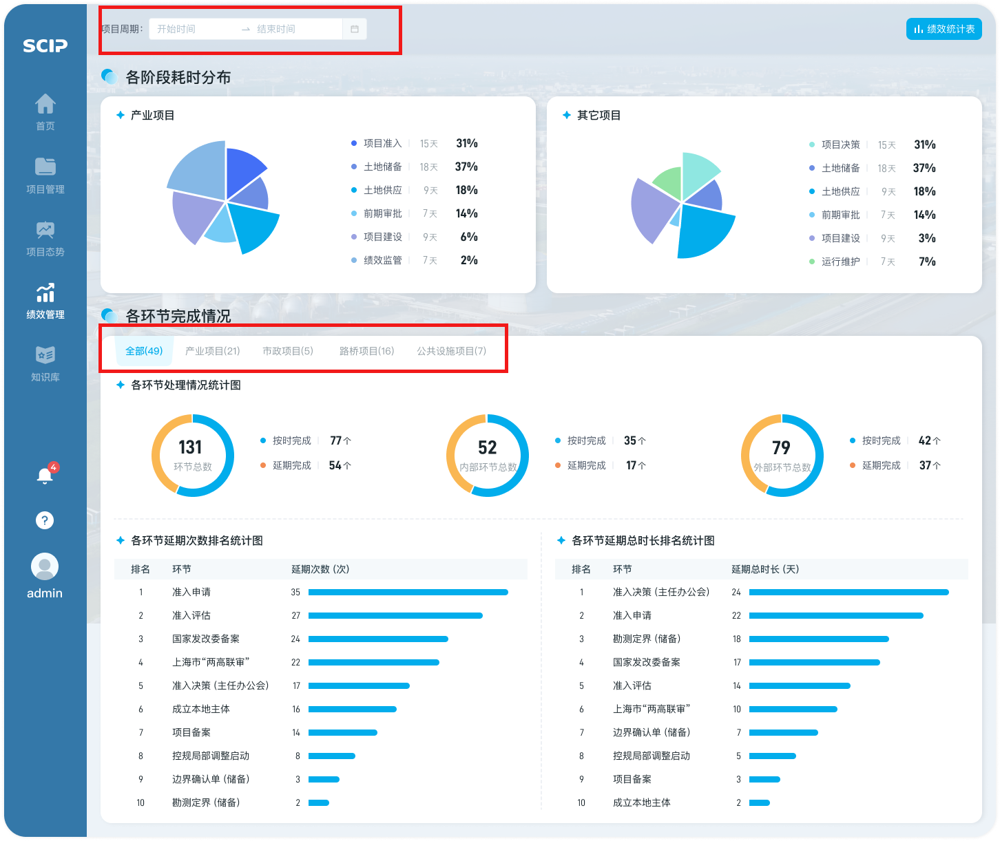
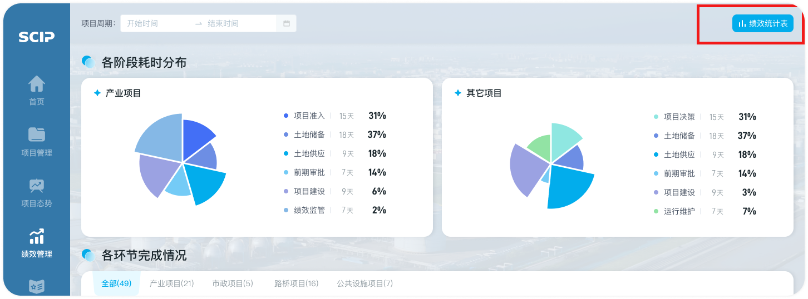
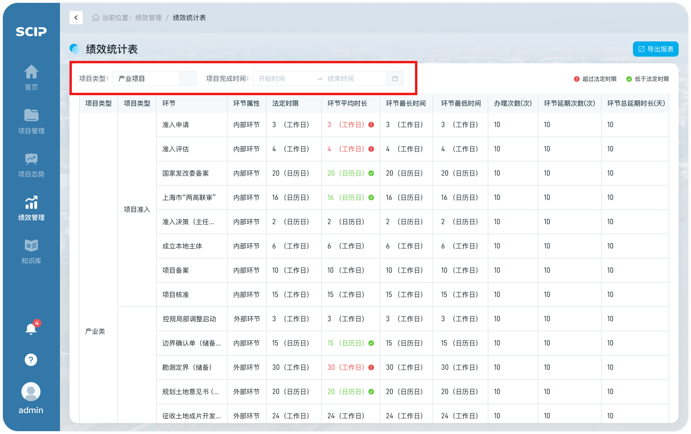
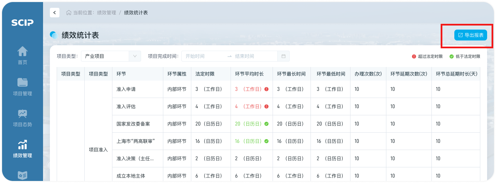

# 绩效管理

## 第一步：进入绩效管理页面

- 【首页-功能面板】可点击【绩效管理】区域，进入绩效管理页面

## 第二步：绩效管理查看

- 进入【绩效管理】页面，可查看【项目推进耗时分布图】和【各环节完成情况】，支持筛选项目周期以查看不同时间段的绩效情况，支持选择“全部项目”、“产业项目”、“市政项目”、“路桥项目”和“公共设施项目”以查看不同类型项目各环节完成情况

## 第三步：绩效统计表查看

- 点击“绩效统计表”，跳转至【绩效统计表】页面

- 【绩效统计表】页面，支持筛选项目类型和项目统计时间以查看不同条件下的项目情况

- 点击“导出报表”，可导出绩效统计报表至用户计算机

