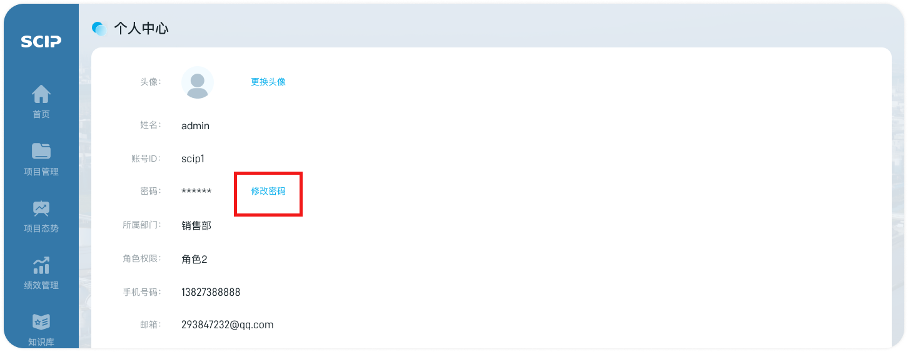
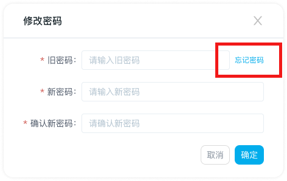

# 修改密码

## 第一步：进入入口

- 【个人中心】，点击密码右侧的“修改密码”

  

## 第二步：修改密码

1. 旧密码、新密码与确认新密码需手动输入

2. 密码至少有两种不同的字符，如数字，标点，大小写字母，不少于12个字符；若不满足格式，输入框会显示错误提醒文字，“格式不正确，请输入至少有两种不同的字符，如数字，标点，大小写字母，不少于12个字符”

3. 旧密码正确且新密码和确认新密码一致，验证才能通过

   1. 若旧密码不正确，则提示“旧密码不正确，请重新输入”；若忘记密码，可点击输入框右侧的“忘记密码？”按钮，进行验证与修改密码

      

   2. 若两次输入新密码不一致，则提示“新密码不一致，请重新输入”