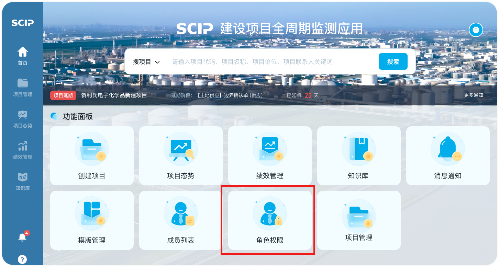
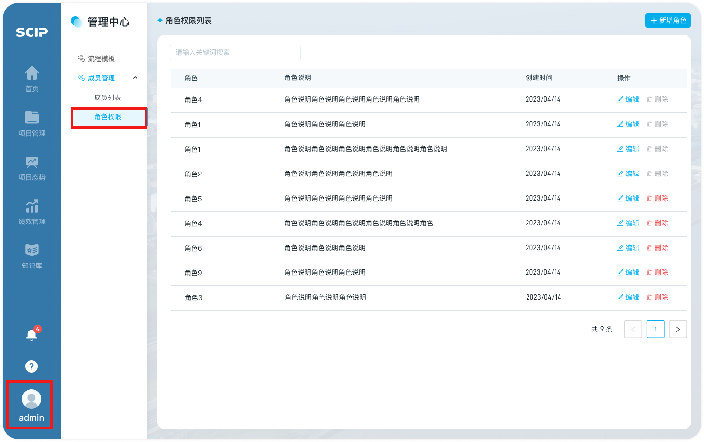
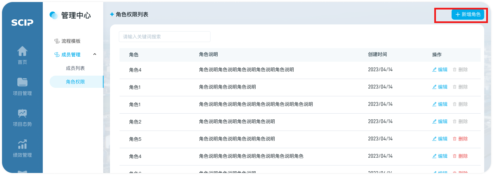
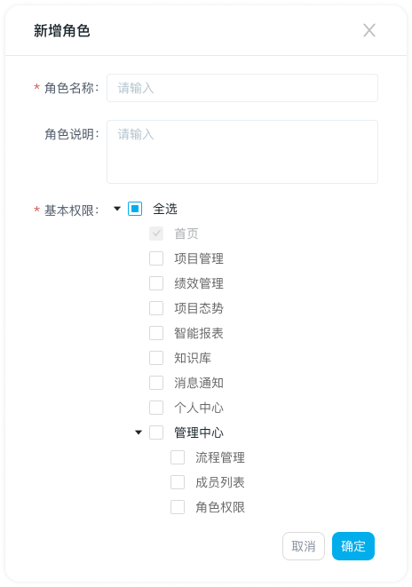

# 新增角色

## 第一步：进入入口

1. 【角色权限】页面

   1. 【首页-功能面板】可点击【角色权限】快捷入口，进入“角色权限”页面

      

   2. 点击导航“头像”，选择“【管理中心】-成员管理”，选择“角色权限”页面

      

2. 进入【角色权限列表】页面， 点击【新增角色】按钮，出现【新增角色】弹窗

   

## 第二步：填写新增角色信息

1. 角色名称：新增角色时填写的数据，系统校验名称唯一性。若编辑修改，更新为最新数据
2. 角色说明：非必填，新增角色时填写的数据，若编辑修改，更新为最新数据
3. 基本权限
   1. 授权权限到菜单级
   2. 菜单分为一级菜单和二级菜单，授权时，首页必选

## 第三步：完成新增角色

1. 新增角色信息置于列表尾部

