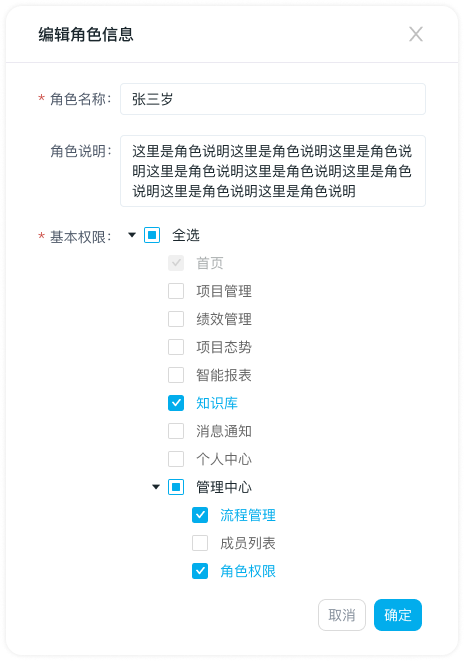

# 角色权限修改

## 第一步：点击某角色“编辑”

- 进入【角色权限列表】页面， 点击目标角色操作列“编辑”按钮，出现【编辑角色信息】弹窗

## 第二步：修改角色信息

1. 角色名称、角色说明、基本权限都可编辑

2. 角色名称重新编辑，关联处更新为最新数据

3. 基本权限：

   1. 呈现所有菜单，并标记该成员已有权限的菜单

   2. 授权时，至少要勾选一个菜单-首页

      

