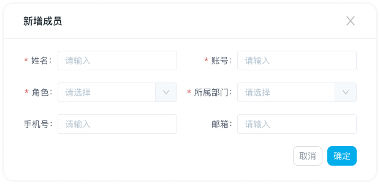

# 新增成员

## 第一步：进入入口

1. 【成员列表】页面

   a. 【首页-功能面板】可点击【成员列表】快捷入口，进入成员列表页面

   b. 点击导航“头像”，选择“【管理中心】-成员管理”，选择“成员列表”页面

2. 进入【成员列表】页面， 点击【新增成员】按钮，出现【新增成员】弹窗

## 第二步：填写新增成员信息

1. 姓名：必填，可输入字母、中文，长度限制在50个字符以内
2. 账号：必填，可使用数字、中文、英文字母任意一种或组合创建账号，英文字母区分大小写，不支持特殊符号（除下划线_）和空格，长度限制在20个字符以内
3. 角色：必填，下拉选，数据源为成员管理-角色权限
4. 所属部门：必填，下拉选择所属部门
5. 手机号：非必填
6. 邮箱：非必填
7. 创建成功后，初始密码为scip666，成员可自行修改

## 第三步：完成新增成员

1. 新增的成员信息置于列表尾部

