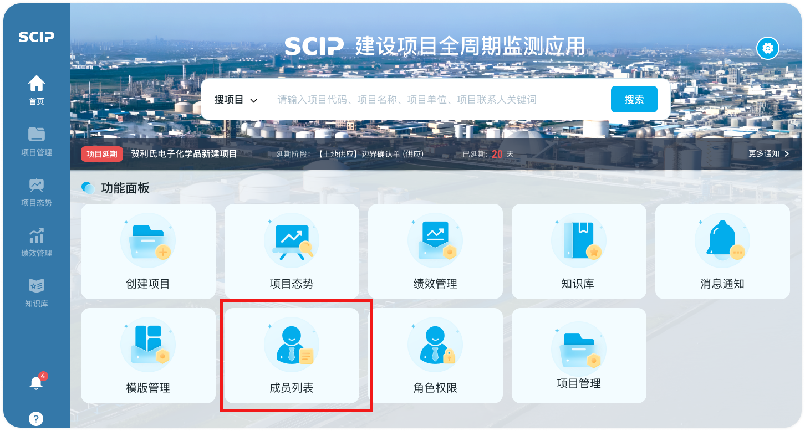
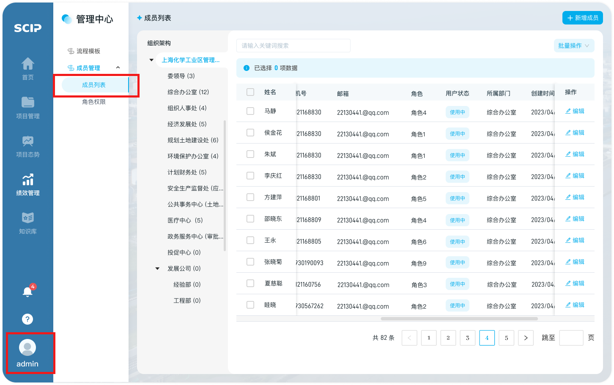
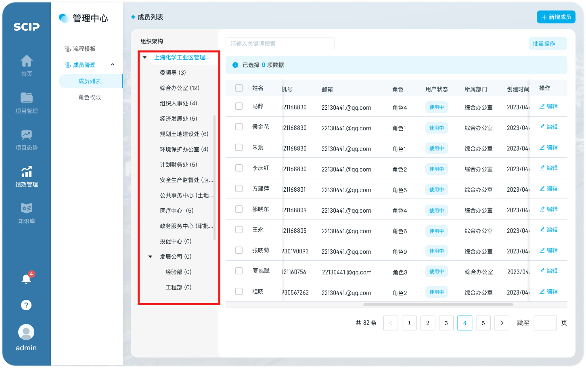
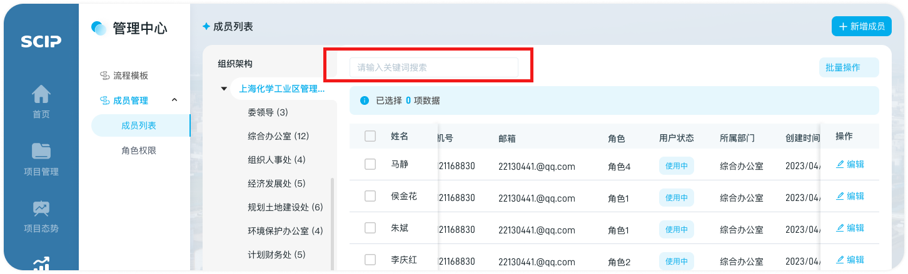

# 成员查询

## 第一步：进入入口

1. 【首页-功能面板】可点击【成员列表】快捷入口，进入成员列表页面

   

2. 点击导航“头像”，选择“【管理中心】-成员管理”，选择“成员列表”页面

   

## 第二步：成员筛选/检索

1. 用户可根据成员所属部门进行快速查找

   

2. 直接在搜索框进行成员关键词检索

   可以在成员列表上提供的检索框中输入关键词，系统会根据用户输入的关键词返回相关成员列表

   

## 第三步：成员信息详情查看

1. 姓名：新增成员时添加数据
2. 账号：新增成员时添加数据
3. 角色：新增成员时选择
4. 所属部门：必填，下拉选择所属部门
5. 手机号：新增成员时添加数据,非必填
6. 邮箱：新增成员时添加数据,非必填
7. 用户状态：
   1. 使用中：变更节点：账号创建后，默认为「使用中」状态
   2. 已停用：变更节点：将「使用中」状态的账号进行「停用」操作后，账号状态变更为「已停用」
8. 创建时间：新增成员时添加数据
9. 操作：可对某成员信息进行编辑

