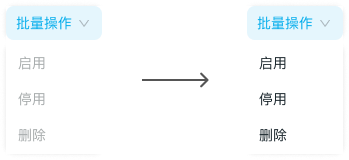
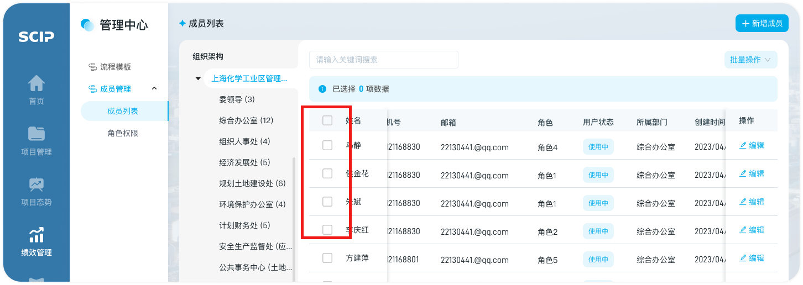
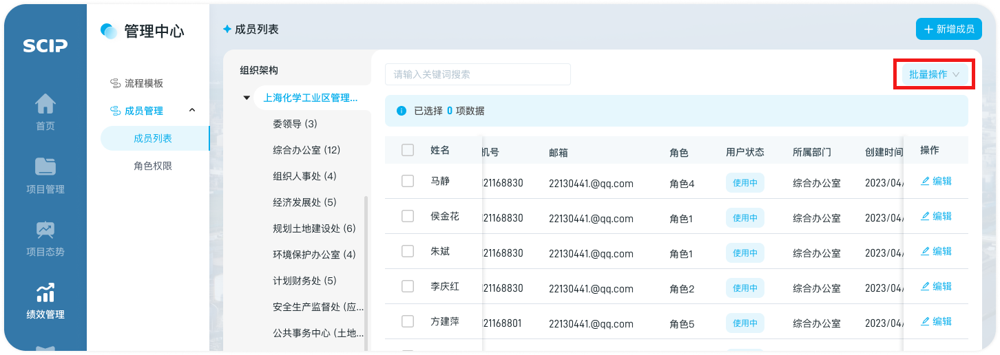
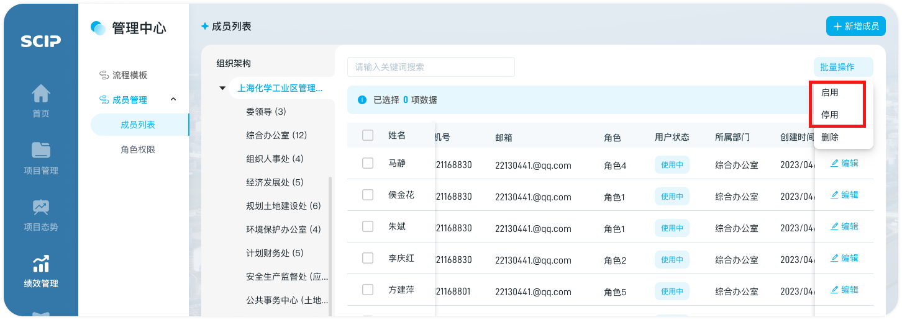

# 成员状态更改

## 第一步：勾选成员（至少一个）

1. 若勾选项目，则“批量操作”内的按钮显示可点击

   

2. 此处可全选当前页的消息，进行批量操作

   

## 第二步：点击“批量操作”

- 【成员列表】表头右上方的“批量操作”

## 第三步：成员状态变更

1. 可对已选择的消息批量设为“启用”、“停用”

   1. 启用：用户可以对被停用用的成员进行启用操作，恢复其权限，能够重新使用系统
   2. 停用：用户可以对勾选的成员停用，暂时撤销其所有权限，即无法使用该系统

   

