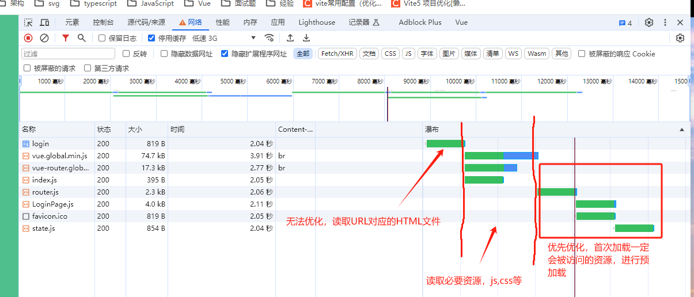
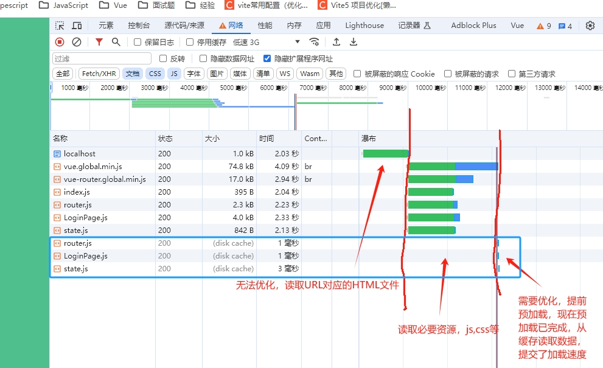

# 浏览器的工作原理

# 导航

导航是加载web页面的第一步。

- 用户通过在地址栏输入了一个URL
- 点击一个链接

网络延迟和带宽会让它变久。

## DNS查询

对于一个web页面来说，导航的第一步是要去寻找页面资源的位置。如果以前没有访问过这个网站，就需要进行DNS查询。

浏览器向域名服务器发起DNS查询请求，最终得到一个IP地址。

每一个HTML页面本身需要1次DNS查询，它内部存在其它外部引用，比如外部script，外部图片，外部字体时，每一个资源的访问可能会触发新的DNS请求。

## TCP握手

得到服务器IP地址后，浏览器会通过**TCP三次握手**与服务器建立连接。


TCP 的“三次握手”技术经常被称为“SYN-SYN-ACK”——更确切的说是 SYN、SYN-ACK、ACK——因为通过 TCP 首先发送了三个消息进行协商，然后在两台电脑之间开始一个 TCP 会话。是的，这意味着当请求尚未发出的时候，终端与每台服务器之间还要来回多发送三条消息。

## TLS协商

通过HTTPS建立的安全连接，还需要进行另一次握手，称为TLS协商，决定使用哪种密码对通信进行加密，验证服务器，建立安全连接。就需要在实际发送内容请求之前，再往返服务器五次。

如此经过 8 次往返，浏览器终于可以发出请求了。

# 响应

一旦浏览器完成8次往返建立起安全连接，浏览器会发生一个初始的HTTP GET 请求，通常是请求一个HTML文件。一旦服务器收到请求，它将使用相关的响应头和HTML内容进行回复。

```html
<!DOCTYPE html>
<html lang="en">

<head>
  <meta charset="UTF-8">
  <title>学习Vue Router4</title>
  <style>
    * {
      margin: 0;
      padding: 0;
    }
  </style>
  <!--导入Vue-->
  <script src="https://cdn.jsdelivr.net/npm/vue@3.4.21/dist/vue.global.min.js"></script>
  <!--导入Vue Router-->
  <script src="https://cdn.jsdelivr.net/npm/vue-router@4.3.2/dist/vue-router.global.min.js"></script>
  <!--导入自己的js文件,module方式-->
  <script type="module" src="./src/index.js"></script>
</head>

<body>
	<div id="app"></div>
</body>

</html>
```

# 解析

HTML文件浏览器收到后，开始解析内容,解析指将HTML文件转换为DOM树和CSSOM树。

- 从头向下解析
- 构建DOM树和CSSOM树，DOM树的根节点是HTML元素。
- 读取到style元素，构建CSSOM树
- 下载Vue.js，vue-router.js，下载完成直接执行，会阻塞DOM渲染，但DOM应该已经构建完成
- 下载index.js，因为是module，所以会在上面2份代码执行完毕，而且DOM构建完毕后执行
- 构建DOM树，因为很简单，所以很快完成

# 初次渲染

将创建的DOM树和CSSOM树组合为一个渲染树，计算每个可见元素的布局，将其绘制到屏幕上。

因此SPA页面，HTML文件的CSS和DOM很少，所以初次绘制很快完成，但没有意义，大部分工作在之后的组件定义中。

至此，传统的页面构建完成。但对于SPA页面来说，构建才刚刚开始，重点在index.js文件里面，因此这里容易形成一个优化点，即浏览器默认在执行到index.js文件时才开始下载index.js文件内部引入的其它文件，不高效，我们可以手动优化，将初次页面可能加载的资源提前在index.html文件中进行加载。

即预加载和预读取

### 预加载

预加载Preloading和预读取Prefetching是优化网页加载性能的2个重要技术手段，尤其在SPA中更为关键。它们主要通过提前加载资源来实现。

预加载适用于高优先级资源，即刻获取

```html
<link rel="preload" as="script" href="xxx">
```

### 预读取

预读取用于低优先级资源，加载用户可能访问的下一个页面的资源，浏览器会在空闲时间加载对应资源。

```html
<link rel="prefetch" as="script" href="">
```



优化之后




