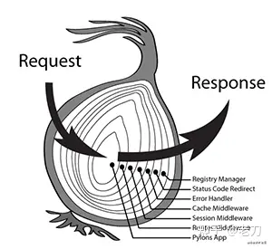
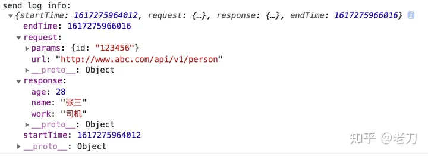

# 中间件Middleware

函数式编程-中间件(Middleware)

## 前言

写中间件模块的初衷，基于想对函数组合模块的反思和补充。原本打算在函数组合那篇文章的基础上丰富完善，但整体篇幅略长，内容略显繁杂，索性重新写一篇。

## 概念

先看一下百度百科的定义：

简而言之，中间件是介于应用系统和系统软件之间的一类软件。用途是衔接网络上应用系统的各个部分或不同的应用，实现资源共享、功能共享。

我们讨论的基础范畴是**函数式编程**，这里的中间件不是真正意义上的中间件。准确点说，它是一种设计模式，编程思想，**是函数与函数之间的组合方式**。这种中间件设计模式，应用最广泛的场景是express和koa框架中，数据请求request和数据响应response的应用模型，通常叫做洋葱模型。



洋葱模型的执行顺序是由外及里，然后由里及外。下面我们举一个简单的例子，来看一下执行过程。

```javascript
const fn1 = (data) => {
  console.log('enter fn1');
  data.step1 = 'step1';
  let rst = fn2(data);
  console.log('exit fn1');
  return rst;
}

const fn2 = (data) => {
  console.log('enter fn2');
  data.step2 = 'step2';
  const rst = fn3(data);
  console.log('exit fn2');
  return rst;
}

const fn3 = (data) => {
  console.log('enter fn3');
  data.step3 = 'step3';
  console.log(data);
  console.log('exit fn3');
  return data;
}

fn1({name: 'Lucy'});
```

执行结果

```javascript
// enter fn1
// VM159:10 enter fn2
// VM159:18 enter fn3
// VM159:20 {name: 'Lucy', step1: 'step1', step2: 'step2', step3: 'step3'}
// VM159:21 exit fn3
// VM159:13 exit fn2
// VM159:5 exit fn1
```

简单分析一下执行处理过程：

- fn1接收数据data，处理后交给fn2，进入fn2的执行流程
- fn2接收数据data，处理后交给fn3，进入fn3的执行流程
- fn3接受数据data，处理后返给fn2，并把执行权还给fn2
- fn2拿到fn3的处理结果，返给fn1，并把执行权还给fn1
- fn1拿到fn2的处理结果，并继续执行完毕

上面的例子非常简略，目的是为了把中间件的设计模型直观清晰的描述清楚。然而，实践中面对的问题会很复杂，不会采用这种彼此耦合调用的编程方式。下面我们一起看一下koa处理此类问题的方式，参照对比一下，就能发现中间件带来的便利和优势：

```javascript
const app = new Koa();

app.use(async (ctx, next) => {
  console.log('enter 1');
  await next();
  console.log('exit 1');
});

app.use(async (ctx, next) => {
  console.log('enter 2');
  await next();
  console.log('exit 2');
});

app.use(async (ctx, next) => {
  console.log('enter 3');
  await next();
  console.log('exit 3');
});
```

Koa的中间件核心模块是koa-compose，有关koa-compose的源码分析有很多，下面我们也会涉及到，但并不是本文讨论的核心。我们的目的是，搞清楚Middleware的实现原理，以便更好的掌握使用它。接下来我们一起探索讨论几种Middleware的实现方式。

## 一个假想的Koa实现

```javascript
class Koa {
  constructor() {
    this.middleware = [];
  }

  use(middleware) {
    this.middleware.push(middleware);
  }

  async handleRequest(ctx) {
    let index = 0;

    const next = async () => { 
      if (index < this.middlewae.length) {
        const middleware = this.middleware[index++];
        await middleware(ctx, next);
      }
    };

    await next();
  }

  async listen(port) {
    console.log(`Server listening on port ${port}`);
  }
}

// 创建 Koa 应用实例
const app = new Koa();

// 注册中间件
app.use(async (ctx, next) => {
  console.log('enter 1');
  await next();
  console.log('exit 1');
});

app.use(async (ctx, next) => {
  console.log('enter 2');
  await next();
  console.log('exit 2');
});

app.use(async (ctx, next) => {
  console.log('enter 3');
  await next();
  console.log('exit 3');
});

// 启动服务器
app.listen(3000);

// 模拟请求处理
app.handleRequest({});
```

## 中间件的实现

### 再说函数组合(Function Compose)

按照前面的实例和应用分析，洋葱模型的调用过程，根函数组合(Function Compose)或者管道(Pipeline)基本类似。都是串联组合函数，控制数据流动的方式。

不同之处是

- 中间件可以主动调用next，中间件可以控制双向数据流
- 而函数组合的next是自动调用。而函数组合只能控制单向数据流。

主动调用更加灵活，可以控制next的调用时机，可以拦截修饰输入数据以及输出数据。下面我们再回顾一下前面讨论过的函数组合的实现，并在此基础上，讨论一下中间件的实现原理。

函数组合的实现原理及应用示例：

```javascript
function compose(...funcs) {
  return function (input) {
    return funcs.reverse().reduce((result, next) => next.call(this, result), input);
  }
}

function output = (input) => {
  [fn1, fn2, fn3].reduce((sum, item) => item.call(this, sum) ,input)
}

const fn1 = d => d + 1;
const fn2 = d => d * 2;
const fn3 = d => Math.pow(d, 2);

compose(fn3, fn2, fn1)(2)// 36
```

compose的原理是基于reduce循环迭代自动执行，整个过程数据单向流动，数据'2'从fn1流入，并流经fn2，fn3，经过3次函数处理，最终输出结果为36。

整个执行过程可以简化为

```javascript
f3(f2(f1(input)))
```

在copmose的基础上，实现中间件需要改动的地方并不多。只需把next执行用函数包裹，暂时缓存，传递给下一个函数，等待主动调用。**原理不难理解，把传递执行结果，变成了传递执行过程**。需要注意的是，compose执行顺序从里到外，middleware执行顺序从外到里，然后再从里到外。应用时注意传参顺序。

下面调整一下compose函数，看一下具体的实现原理。

```javascript
function middleware(...funcs) {
  return funcs.reverse().reduce((result, next) => arg => next.call(this, arg, result) ,() => null);
}


const fn1 = (data, next) => {
  console.log('enter 1');
  data.step1 = 'step1';
  next(data);
  console.log(data)
  console.log('exit 1')
}

const fn2 = (data,next) => {
    console.log('enter 2')
    data.step2 = 'step2'
    next(data)
    console.log('exit 2')
}

const fn3 = (data,next) => {
    console.log('enter 3')
    data.step3 = 'step3'
    next()
    console.log('exit 3')
}

middleware(fn1,fn2,fn3)({})

// 程序解读
function middleware(...funcs) {
  const reverseFuncs = funcs.toReversed();
  const result = reverseFuncs.reduce((result, next) => {
    return arg => next.call(this, arg, result)
  }, () => {});
}

arg1 => fn3(arg1, )
```

输出结果

```javascript
enter 1
enter 2
enter 3
exit 3
exit 2
{ name: 'Lucy', step1: 'step1', step2: 'step2', step3: 'step3' }
exit 1
```

为了便于理解，我们拆解一下reduce执行过程：

```javascript
// 第一次
(arg1)=>f3(arg1, (arg2)={})
// 第二次
(arg1)=>f2(arg1, (arg2)=>f3(arg2, (arg3)={}))
// 第三次
(arg1)=>f1(arg1,(arg2)=>f2(arg2,(arg3)=>f3(arg3,(arg4)={})))
```

实践中，中间件模式的应用，多数都涉及到异步场景。上面的middleware还缺乏异步处理的支持。接下来，我继续调整，对middleware添加异步的支持。添加异步支持的思路有两种，一种是把执行结果转换成Promise；一种是把next函数变成async...await。

我们先看一下基于Promise的思路：

```javascript
function middleware(...funcs) {
    return funcs.reverse().reduce((result, next) => (arg) => Promise.resolve(next.call(this, arg, result)), () => Promise.resolve())
}

const getData = () => new Promise((resolve) => setTimeout(() => resolve(), 2000))

const fn1 = async (data, next) => {
    console.log('enter 1')
    data.step1 = 'step1'
    await next(data)
    console.log(data)
    console.log('exit 1')
}
const fn2 = async (data, next) => {
    console.log('enter 2')
    data.step2 = 'step2'
    await getData()
    await next(data)
    console.log('exit 2')
}

const fn3 = async (data, next) => {
    console.log('enter 3')
    data.step3 = 'step3'
    await next(data)
    console.log('exit 3')
}

middleware(fn1, fn2, fn3)({ name: 'Lucy' })
```

执行结果

```javascript
enter 1
enter 2
enter 3
exit 3
exit 2
{ name: 'Lucy', step1: 'step1', step2: 'step2', step3: 'step3' }
exit 1
```

下面再看一下借助async...await实现支持异步的思路：

```js
function middleware(...funcs) {
    return funcs.reverse().reduce((result, next) => {
        return async (arg) => {
            await next.call(this, arg, await result)
        }
    }, async () => { })
}
```

实现compose的方式有很多，在compose的基础上实现middleware的方式也有很多，比如基于for...of的middleware。

```js
function middleware(...funcs) {
    return (input) => {
        let result = arg => arg

        for (let next of funcs.reverse()) {
            result = ((next, result) => async (arg) => await next(arg, result))(next, result)
        }

        return result(input)
    }
}
```

总而言之，实现middleware的基本原理都是函数组合，把传递执行结果，转换为传递执行过程函数；把自动执行，转换为手动执行next；把控制单向数据流，转换成了可以控制双向数据流。**middleware**同样具备函数组合可拆分、可组合、易于管理、可读性强的特性。

## 换个角度看compose

我们通过数据传输角度，讨论compose基础上实现middleware。基本原理是，把传递执行结果，转换为传递执行过程。我们换个角度，思考一个问题：如果组合函数执行结果就是函数呢？

```js
const fn1 = (next) => (data) => {
    console.log('enter fn1')
    next(data)
    console.log('exit fn1')
}

const fn2 = (next) => (data) => {
    console.log('enter fn2')
    next(data)
    console.log('exit fn2')
}

const fn3 = (next) => (data) => {
    console.log('enter fn3')
    console.log(next(data))
    console.log('exit fn3')
}

let cm = compose(fn1, fn2, fn3)
let fc = cm(() => {})
fc({ name: 'Lucy' })
```

执行过程

```js
// 第一步compose(fn1,fn2,fn3)得到
cm = (input)=>f1(f2(f3(input)))

// 第二步输入cm(()=>{})
fc = function rst1(data){
    ~(function rst2(data){
        ~(function rst3(data){
            input()
        })()
    })()
}

// 第三步
fc({name:'Lucy'})
```

结果

```js
enter fn1
enter fn2
enter fn3
{ name: 'Lucy' }
exit fn3
exit fn2
exit fn1
```

# koa-compose

node.js开发应用最广泛的是koa框架，它的基础是middleware，核心模块是koa-compose。koa-compose的实现代码很精炼，有很多地方值得我们学习和参考。

下面看一下koa-compose的实现代码。

```js
function compose(middleware) {
  return function (context, next) {
    let index = -1;
    
    function dispatch(i) {
      // 避免重复调用
      if (i <= index) {
        return Promise.reject(new Error('next() called multiple times'));
      }
      index = i;
      let fn = middleware[i];
      // compose最后的回调函数
      if (i === middleware.length) {
        fn = next;
      }
      if (!fn) {
        return Promise.resolve();
      }
      try {
        // 核心执行代码，缓存执行next，并支持异步
        return Promise.resolve(fn(context, function next() {
          return dispatch(i + 1);
        }))
      } catch (err) {
        return Promise.reject(err);
      }
    }
    
    return dispatch(0);
  }
}
```

koa-compose的实现原理，跟我们前面讨论的middleware实现原理基本相同。思路都是把传递执行结果，转换为传递执行过程。区别在于，koa-compose基于递归循环迭代，而我们是基于reduce或for..of。koa-compose细节处理比较完善，比如参数验证和多次调用next的问题。

简单讨论一下关于next重复调用的问题。理论上，一个执行流程中，一个中间件应该只执行一次。换句话说，同一个next，只允许调用一次，如果多次调用，应该抛出异常。

我们把上面的fn2调整一下

```js
const fn2 = async (data, next) => {
    console.log('enter 2')
    data.step2 = 'step2'
    await getData()
    await next(data)
    await next(data)
    console.log('exit 2')
}

compose([fn1, fn2, fn3])({ name: 'Lucy' }, (data)=>{
    console.log(data)
})
```

执行结果，报UnhandledPromiseRejectionWarning: Error: next() called multiple times

```js
enter 1
enter 2
enter 3
exit 3
(node:52325) UnhandledPromiseRejectionWarning: Error: next() called multiple times
```

## 完整的Middleware

前面我们讨论了基于compose实现middleware的原理，下面我们一起实现一个完整的Middleware。首先，Middleware需要具备一个可以管理所有middlewares的属性；其次，还需要具备一个类似于app.use，可以添加middlewares的方法；另外，还需要一个触发执行middlewares流程的方法。

```js
function Middleware(...middlewares) {
    const stack = middlewares

    const push = (...middlewares) => {
        stack.push(...middlewares)
        return this
    }

    const execute = async (context, callback) => {
        let prevIndex = -1
        const runner = (index) => {
            if (index === prevIndex) {
                throw new Error('next() called multiple times')
            }
            prevIndex = index
            let middleware = stack[index]
            if (prevIndex === stack.length) middleware = callback

            if (!middleware) return Promise.resolve()

            try {
                return Promise.resolve(middleware(context, () => {
                    return runner(index + 1)
                }))
            } catch (err) {
                return Promise.reject(err)
            }
        }

        return runner(0)
    }

    return { push, execute }
}

let middleware = Middleware()
middleware.push(fn1)
middleware.push(fn2)
middleware.push(fn3)

middleware.execute({ name: 'Lucy' }, (ctx) => console.log(ctx))
```

下面给出Middleware的typescript版本以及Middleware类版本

typescript版本Middleware

```js
type Next = () => Promise<void> | void
type TMiddleware<T> = (context: T, next: Next) => Promise<void> | void
type IMiddleware<T> = {
    push: (...middlewares: TMiddleware<T>[]) => void
    execute: (context: T, callback: Next) => Promise<void>
}

function Middleware<T>(...middlewares: TMiddleware<T>[]): IMiddleware<T> {
    const stack: TMiddleware<T>[] = middlewares

    const push: IMiddleware<T>['push'] = (...middlewares) => {
        stack.push(...middlewares)
        return this
    }

    const execute: IMiddleware<T>['execute'] = (context, callback) => {
        let prevIndex = -1
        const runner = async (index: number): Promise<void> => {
            if (index === prevIndex) {
                throw new Error('next() called multiple times')
            }
            prevIndex = index
            let middleware = stack[index]

            if (prevIndex === stack.length) middleware = callback

            if (!middleware) return Promise.resolve()

            try {
                return Promise.resolve(middleware(context, () => {
                    return runner(index + 1)
                }))
            } catch (err) {
                return Promise.reject(err)
            }
        }

        return runner(0)
    }
    return { push, execute }
}
```

Middleware类

```js
type Next = () => Promise<void> | void
type TMiddleware<T> = (context: T, next: Next) => Promise<void> | void
type IMiddleware<T> = {
    push: (...middlewares: TMiddleware<T>[]) => void
    execute: (context: T, callback: Next) => Promise<void>
}

class Middleware<T> implements IMiddleware<T>{
    stack: TMiddleware<T>[] = []

    static create<T>(...middlewares: TMiddleware<T>[]) {
        return new Middleware(...middlewares)
    }

    constructor(...middlewares: TMiddleware<T>[]) {
        this.stack = middlewares
    }

    public push(...middlewares: TMiddleware<T>[]) {
        this.stack.push(...middlewares)
        return this
    }

    public execute(context?, callback?) {
        let prevIndex: number = -1
        const runner = async (index: number): Promise<void> => {
            if (index === prevIndex) {
                throw new Error('next() called multiple times')
            }
            prevIndex = index
            let middleware = this.stack[index]

            if (prevIndex === this.stack.length) middleware = callback

            if (!middleware) return Promise.resolve()

            try {
                return Promise.resolve(middleware(context, () => {
                    return runner(index + 1)
                }))
            } catch (err) {
                return Promise.reject(err)
            }
        }

        return runner(0)
    }

}
```

## 实践应用

中间件在web服务开发领域的应用，最为广泛，最为大家熟知的是node.js开发。比较典型也是应用最多的是koa框架。Koa是由Express幕后的原班人马打造，新的web框架。基础核心模块是中间件，用于控制请求数据流Request和响应数据流Response。

```js
const Koa = require('koa')
const app = new Koa()

app.use(async ctx => {
    ctx.body = 'Hello World'
})

app.use(async (ctx, next) => {
    const start = Date.now()
    await next()
    const ms = Date.now() - start
    ctx.set('X-Response-Time', `${ms}ms`)
})

app.use(async (ctx, next) => {
    await getData()
    next()
})

app.listen(3000)
```

在前端开发领域，中间件应用广泛。网络数据请求日志，性能监控、用户行为埋点信息都是中间价典型应用场景。

些辅助业务信息非常重要，但并不是主业务流程。而且这些辅助业务信息散乱耦合在项目主业务流程的各个环节，不易管理，项目越大，越难以维护。可以利用中间件，把这些辅助业务从主业务流程中分离解耦，作为独立的模块开发和维护。这符合模块设计的功能单一性，同时也能提高模块的可维护性和可移植性。

下面我们通过一个具体的示例，演示一下中间件在前端的应用。

service.js

```js
export const getData = (url, param) => new Promise((resolve) => setTimeout(() => resolve({
    name: '张三',
    age: 28,
    work: '司机'
}), 2000))
```

index.js

```js
import { Middleware } from './middleware.js'
import { log } from './log-middleware.js'
import { getData } from './service.js'

export const fetchPerson = (url, params) => {
    let mw = Middleware()
    mw.push(log)

    mw.push(async (ctx, next) => {
        let person = await getData(url, params)
        ctx.res = person
        next()
    })

    mw.execute({ url, params }, ctx => {
        console.log(ctx.res)
    })
}

export default {
    start() {
        fetchPerson('http://www.abc.com/api/v1/person', {
            id: '123456'
        })
    }
}
```

log-middleware.js

```js
export const log = async (ctx, next) => {
    let { url, params } = ctx
    let log = {
        startTime: Date.now(),
        request: {
            url,
            params
        }
    }

    await next()

    log.response = ctx.res
    log.endTime = Date.now()

    console.log(`send log info:\n`, log)
}
```

index.html

```html
<!DOCTYPE html>
<html lang="en">

<head>
    <meta charset="UTF-8">
    <meta name="viewport" content="width=device-width, initial-scale=1.0, minimum-scale=1.0,maximum-scale=1.0, user-scalable=0">
    <title>Document</title>
</head>

<body>
    <script type="module">
        import app from './index.js'
        app.start()
    </script>
</body>

</html>
```

结果：




